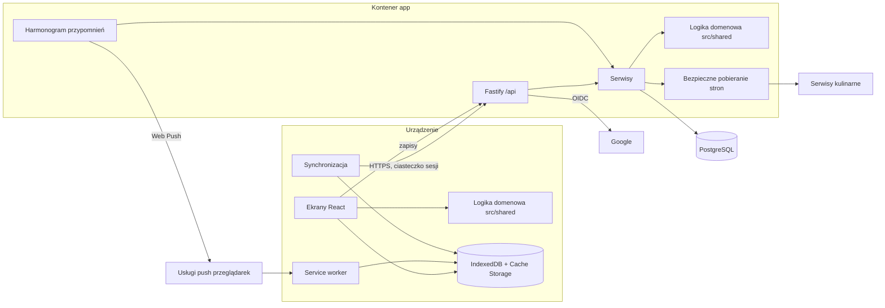

# Mounjaro Przepisy

## TLDR

Prywatna aplikacja webowa, instalowalna na telefonie jako PWA, w której jedna osoba na diecie wspieranej lekiem Mounjaro gromadzi sprawdzone przepisy z serwisów kulinarnych i własne. Aplikacja filtruje je pod potrzeby tej diety (dużo białka, małe i lekkostrawne porcje), prowadzi przez gotowanie także bez internetu, a w kolejnych etapach dodaje wyszukiwanie w zaufanych serwisach, planer tygodnia z listą zakupów oraz dziennik zdrowia. Aplikacja nie generuje przepisów i nie wylicza dawek leku.

## Problem i cel

Osoba przyjmująca Mounjaro je mało, często ma nudności i musi pilnować białka. Przepisy w internecie nie są opisane pod te potrzeby, a przepisom generowanym przez AI nie da się ufać co do smaku. Właściciel chce jednego miejsca ze sprawdzonymi przepisami (z prawdziwych źródeł, z ocenami ludzi), które szybko odpowiada na pytanie „co dziś ugotować, żeby było smaczne, białkowe i żebym to dobrze zniósł”.

**Miara sukcesu:** po miesiącu od uruchomienia etapu 1 użytkownik gotuje z aplikacji co najmniej 3 razy w tygodniu. Źródłem pomiaru jest historia tygodniowa ugotowań w aplikacji (S8).

## Słownik

- **Kolekcja:** wszystkie przepisy użytkownika.
- **Kolekcja własna:** nazwana grupa przepisów utworzona przez użytkownika (np. „Śniadania”).
- **Przepis z linku / przepis ręczny:** przepis odczytany z cudzej strony albo wpisany przez użytkownika.
- **Brak danych:** stan wartości odżywczej, której nie podało źródło, nie dało się wyliczyć i użytkownik jej nie wpisał.
- **Offline:** urządzenie bez połączenia z internetem.

## Użytkownicy i role

- **Użytkownik (jedyna rola):** jedna osoba wskazana przy instalacji aplikacji (właściciel albo bliska mu osoba). Ma dostęp do wszystkich funkcji i wszystkich danych. Konto nie jest współdzielone.
- Aplikacja obsługuje dokładnie jedno konto. Zalogować się może wyłącznie jeden adres Google ustawiony przy instalacji aplikacji.
- **Osoba niezalogowana** widzi tylko ekran logowania. Nie widzi żadnych przepisów ani danych.
- Nie ma rejestracji, ról administracyjnych, udostępniania ani widoków publicznych.

## Scenariusze

Kryteria dotyczące odczytu cudzych stron i wyszukiwania (S2, S3, S5, S17, S18) są weryfikowane na zestawie stron testowych opisanym w „Wymaganiach niefunkcjonalnych”, a nie na żywych serwisach.

### Etap 1: kolekcja przepisów (MVP)

#### S1: Logowanie kontem Google

1. Użytkownik otwiera aplikację i wybiera „Zaloguj przez Google”.
2. Po zalogowaniu dozwolonym kontem widzi swoją kolekcję.

**Kryteria akceptacji**
- Zakładając, że użytkownik nie jest zalogowany, gdy otwiera dowolny adres aplikacji, wtedy widzi ekran logowania i żadnych danych.
- Zakładając, że użytkownik loguje się dozwolonym adresem Google z ekranu głównego, gdy logowanie się powiedzie, wtedy widzi kolekcję.
- Zakładając, że niezalogowany użytkownik otworzył adres konkretnego ekranu (np. przepisu), gdy zaloguje się dozwolonym adresem, wtedy widzi ten ekran.
- Zakładając, że ktoś loguje się innym adresem Google, gdy logowanie w Google się powiedzie, wtedy aplikacja pokazuje komunikat „To konto nie ma dostępu” i nie pokazuje żadnych danych.
- Zakładając, że użytkownik jest zalogowany i ma internet, gdy wybiera „Wyloguj”, wtedy wraca na ekran logowania.
- Zakładając urządzenie, na którym aplikacja była otwierana z internetem w ciągu ostatnich 30 dni, gdy użytkownik ją otworzy, wtedy jest zalogowany bez ponownego logowania.
- Zakładając urządzenie, na którym aplikacja nie była otwierana z internetem przez ponad 30 dni (test przesuwa zegar), gdy użytkownik ją otworzy, wtedy widzi ekran logowania i żadnych danych.
- Zakładając, że użytkownik dodał przepis na telefonie, gdy loguje się tym samym kontem na komputerze, wtedy widzi ten przepis.

#### S2: Dodanie przepisu z linku

1. Użytkownik wybiera „Dodaj przepis” → „Z linku” i wkleja adres strony z przepisem.
2. Aplikacja odczytuje przepis i pokazuje podgląd.
3. Użytkownik może poprawić dane i zapisuje przepis.

**Kryteria akceptacji**
- Zakładając link do strony testowej „czytelna”, gdy użytkownik go wklei i zatwierdzi, wtedy widzi podgląd z tytułem, zdjęciem, listą składników, krokami, liczbą porcji oraz oceną i liczbą opinii ze źródła, zgodnymi z treścią strony testowej.
- Zakładając podgląd odczytanego przepisu, gdy użytkownik wybierze „Zapisz”, wtedy przepis pojawia się w kolekcji z pełną treścią, zdjęciem, linkiem do źródła, oceną ze źródła i liczbą opinii.
- Zakładając zapisany przepis z linku, gdy użytkownik otworzy jego szczegóły, wtedy widzi nazwę serwisu źródłowego i link otwierający oryginalną stronę.
- Zakładając link do strony testowej „bez oceny”, gdy przepis zostanie zapisany, wtedy w miejscu oceny ze źródła widnieje „brak oceny”.
- Zakładając link do strony testowej „bez liczby porcji”, gdy pojawi się podgląd, wtedy pole liczby porcji jest puste, a zapis jest możliwy dopiero po jego wypełnieniu.
- Zakładając link do strony testowej „bez zdjęcia”, gdy przepis zostanie zapisany, wtedy ma grafikę zastępczą, a zdjęcie da się dodać przy edycji.
- Zakładając, że przepis z tego samego adresu jest już w kolekcji, gdy użytkownik wklei ten link ponownie, wtedy aplikacja informuje, że przepis już jest, i proponuje przejście do niego zamiast tworzenia kopii. Adresy są uznawane za takie same, jeśli różnią się tylko protokołem, przedrostkiem „www”, końcowym ukośnikiem, parametrami po „?” lub fragmentem po „#”.
- Zakładając, że odczyt trwa, gdy użytkownik czeka, wtedy widzi wskaźnik postępu, a najpóźniej po 15 sekundach podgląd albo komunikat z S3.

#### S3: Link, którego nie da się odczytać

1. Użytkownik wkleja link, z którego aplikacja nie potrafi odczytać całego przepisu.
2. Aplikacja otwiera formularz ręczny z linkiem i tym, co udało się odczytać.
3. Użytkownik uzupełnia braki i zapisuje.

**Kryteria akceptacji**
- Zakładając link do strony testowej „bez składników” albo „nie-przepis”, gdy użytkownik go zatwierdzi, wtedy aplikacja pokazuje komunikat „Nie udało się odczytać całego przepisu” i otwiera formularz ręczny z wypełnionym linkiem do źródła oraz polami, które udało się odczytać.
- Zakładając taki formularz, gdy użytkownik uzupełni tytuł, liczbę porcji, co najmniej jeden składnik i co najmniej jeden krok, a potem zapisze, wtedy przepis trafia do kolekcji z linkiem do źródła.
- Zakładając link do strony testowej „niedostępna” (brak odpowiedzi przez 15 sekund albo błąd), gdy użytkownik go zatwierdzi, wtedy widzi komunikat „Strona nie odpowiada” i może ponowić próbę albo przejść do formularza ręcznego z zachowanym linkiem.
- Zakładając tekst, który nie jest adresem strony, gdy użytkownik go zatwierdzi, wtedy widzi komunikat „To nie jest poprawny link” i pole pozostaje do poprawy.

#### S4: Ręczne dodanie przepisu

1. Użytkownik wybiera „Dodaj przepis” → „Ręcznie”.
2. Wpisuje tytuł, liczbę porcji, składniki (ilość, jednostka, nazwa), kroki; opcjonalnie dodaje zdjęcie, link do źródła i wartości odżywcze na porcję.
3. Zapisuje.

**Kryteria akceptacji**
- Zakładając wypełniony tytuł, liczbę porcji, co najmniej jeden składnik i co najmniej jeden krok, gdy użytkownik wybierze „Zapisz”, wtedy przepis pojawia się w kolekcji oznaczony jako „ręczny”.
- Zakładając brak tytułu, liczby porcji, składników albo kroków, gdy użytkownik wybierze „Zapisz”, wtedy przepis nie zostaje zapisany, a każde brakujące pole jest wskazane komunikatem.
- Zakładając pole liczby porcji, gdy użytkownik wpisze wartość spoza zakresu 0,5–99 albo niebędącą wielokrotnością 0,5, wtedy przepis nie zostaje zapisany i pole jest wskazane komunikatem.
- Zakładając składnik, gdy użytkownik poda tylko nazwę bez ilości i jednostki (np. „sól do smaku”), wtedy składnik zostaje przyjęty.
- Zakładając przepis ręczny bez zdjęcia, gdy pojawia się on na liście, wtedy ma grafikę zastępczą.
- Zakładając utratę połączenia w chwili zapisu, gdy zapis się nie powiedzie, wtedy użytkownik widzi komunikat, a wpisane dane pozostają w formularzu.

#### S5: Wartości odżywcze

Każdy przepis ma cztery wartości na porcję: kalorie (kcal), białko (g), tłuszcz (g), błonnik (g). Każda wartość ma pochodzenie: „ze źródła”, „szacunkowe”, „wpisane ręcznie” albo jest w stanie „brak danych”. Kalorie są pokazywane w liczbach całkowitych, pozostałe wartości z dokładnością do 1 g.

1. Jeśli źródło podaje wartości, aplikacja je przejmuje.
2. Jeśli źródło nie podaje wartości (lub przepis jest ręczny i użytkownik ich nie wpisał), aplikacja wylicza je z listy składników.
3. Użytkownik może każdą wartość wpisać ręcznie.

**Kryteria akceptacji**
- Zakładając link do strony testowej „z wartościami odżywczymi”, gdy przepis zostanie zapisany, wtedy cztery wartości są równe podanym na stronie i oznaczone „ze źródła”.
- Zakładając przepis referencyjny bez wartości ze źródła, którego wszystkie składniki są w zestawie danych testowych o składnikach, gdy zostanie zapisany, wtedy każda wartość jest oznaczona „szacunkowe” i równa sumie wartości składników podzielonej przez liczbę porcji, z tolerancją zaokrąglenia ±1.
- Zakładając przepis, w którym części składników nie udało się rozpoznać, gdy użytkownik otworzy szczegóły wartości odżywczych, wtedy widzi listę nierozpoznanych składników i informację, że nie zostały one wliczone.
- Zakładając przepis bez wartości ze źródła, w którym nie rozpoznano żadnego składnika, gdy użytkownik otworzy jego szczegóły, wtedy każda z czterech wartości pokazuje „brak danych” i możliwość wpisania jej ręcznie.
- Zakładając link do strony testowej „z częścią wartości”, gdy przepis zostanie zapisany, wtedy wartości podane na stronie są oznaczone „ze źródła”, a pozostałe „szacunkowe”.
- Zakładając dowolny przepis, gdy użytkownik wpisze własną wartość (przy tworzeniu albo później) i zapisze, wtedy wartość jest oznaczona „wpisane ręcznie”.
- Zakładając wartość „wpisane ręcznie” albo „ze źródła”, gdy użytkownik zmieni składniki lub liczbę porcji przepisu i zapisze, wtedy ta wartość się nie zmienia.
- Zakładając wartość „szacunkowe”, gdy użytkownik zmieni składniki lub liczbę porcji przepisu i zapisze, wtedy wartość zostaje wyliczona ponownie z aktualnych danych.
- Zakładając wartość „wpisane ręcznie”, gdy użytkownik wybierze „Przywróć wyliczenie”, wtedy wraca wartość ze źródła, a gdy źródło jej nie podało, wartość wyliczona z aktualnych składników.
- Zakładając pole wartości odżywczej, gdy użytkownik wpisze liczbę ujemną albo tekst, wtedy wartość nie zostaje zapisana i widoczny jest komunikat.

#### S6: Przeglądanie kolekcji, filtry i sortowanie

1. Użytkownik otwiera kolekcję i widzi listę przepisów.
2. Włącza filtry jednym tapnięciem i ewentualnie zmienia sortowanie.
3. Otwiera przepis.

Filtry pod Mounjaro: „Wysokie białko”, „Mała porcja”, „Lekkostrawne (mało tłuszczu)”, „Dużo błonnika”, „Mało kalorii”. Pozostałe filtry: „Dobrze toleruję” (S9), „Na gorsze dni” (S10), kolekcja własna (S11). „Mała porcja” i „Mało kalorii” świadomie korzystają z tej samej wartości (kalorie na porcję) z różnymi progami.

**Kryteria akceptacji**
- Zakładając kolekcję z przepisami, gdy użytkownik ją otworzy, wtedy przepisy są posortowane malejąco według białka na porcję, a każda pozycja pokazuje tytuł, zdjęcie albo grafikę zastępczą, białko i kalorie na porcję oraz, jeśli istnieją, ocenę ze źródła i własną ocenę.
- Zakładając przepis z „brak danych” dla białka lub kalorii, gdy pojawia się on na liście, wtedy w miejscu tej wartości widnieje „—”.
- Zakładając pustą kolekcję, gdy użytkownik ją otworzy, wtedy widzi zachętę do dodania pierwszego przepisu z przyciskami „Z linku” i „Ręcznie”.
- Zakładając próg białka 25 g, gdy użytkownik włączy „Wysokie białko”, wtedy lista zawiera tylko przepisy z białkiem ≥ 25 g na porcję.
- Zakładając próg małej porcji 300 kcal, gdy użytkownik włączy „Mała porcja”, wtedy lista zawiera tylko przepisy z ≤ 300 kcal na porcję.
- Zakładając próg tłuszczu 15 g, gdy użytkownik włączy „Lekkostrawne”, wtedy lista zawiera tylko przepisy z tłuszczem ≤ 15 g na porcję.
- Zakładając próg błonnika 5 g, gdy użytkownik włączy „Dużo błonnika”, wtedy lista zawiera tylko przepisy z błonnikiem ≥ 5 g na porcję.
- Zakładając próg kalorii 400 kcal, gdy użytkownik włączy „Mało kalorii”, wtedy lista zawiera tylko przepisy z ≤ 400 kcal na porcję.
- Zakładając przepis z „brak danych” dla białka, gdy użytkownik włączy „Wysokie białko”, wtedy przepisu nie ma na liście; ta sama zasada dotyczy każdego filtra opartego na wartości, której przepis nie ma.
- Zakładając kilka włączonych filtrów, gdy lista się odświeży, wtedy zawiera tylko przepisy spełniające wszystkie włączone filtry jednocześnie.
- Zakładając, że żaden przepis nie spełnia filtrów, gdy lista się odświeży, wtedy użytkownik widzi komunikat „Brak przepisów dla tych filtrów” i przycisk „Wyczyść filtry”.
- Zakładając listę przepisów, gdy użytkownik zmieni sortowanie, wtedy może wybrać: białko na porcję malejąco (domyślne), własna ocena malejąco, ocena ze źródła malejąco, kalorie rosnąco, ostatnio dodane.
- Zakładając dowolne sortowanie według wartości lub oceny, gdy na liście są przepisy bez tej wartości lub oceny, wtedy znajdują się one na końcu listy.
- Zakładając dwa przepisy o równej wartości sortowania, gdy lista się wyświetli, wtedy wyżej jest przepis dodany później.
- Zakładając kolekcję, gdy użytkownik wpisze tekst w pole wyszukiwania, wtedy lista zawiera tylko przepisy, których tytuł lub nazwa składnika zawiera ten tekst, bez rozróżniania wielkości liter i polskich znaków (np. „losos” znajduje „Łosoś pieczony”).
- Zakładając wpisany tekst wyszukiwania i włączone filtry, gdy lista się odświeży, wtedy zawiera tylko przepisy spełniające jedno i drugie.
- Zakładając włączone filtry i zmienione sortowanie, gdy użytkownik otworzy przepis i wróci do listy, wtedy filtry i sortowanie są zachowane; po ponownym uruchomieniu aplikacji lista jest bez filtrów i z sortowaniem domyślnym.

#### S7: Progi filtrów w ustawieniach

1. Użytkownik otwiera Ustawienia → „Progi filtrów”.
2. Zmienia wartości i zapisuje.

Wartości domyślne na porcję: białko ≥ 25 g, tłuszcz ≤ 15 g, błonnik ≥ 5 g, kalorie ≤ 400 kcal, mała porcja ≤ 300 kcal.

**Kryteria akceptacji**
- Zakładając nowe konto, gdy użytkownik otworzy „Progi filtrów”, wtedy widzi pięć wartości domyślnych podanych wyżej.
- Zakładając, że użytkownik zmieni próg białka na 30 g i zapisze, gdy włączy filtr „Wysokie białko”, wtedy lista zawiera tylko przepisy z białkiem ≥ 30 g na porcję.
- Zakładając zmienione progi, gdy użytkownik wybierze „Przywróć domyślne”, wtedy wracają wartości domyślne.
- Zakładając pole progu, gdy użytkownik wpisze wartość ujemną, zero albo tekst, wtedy zmiana nie zostaje zapisana i widoczny jest komunikat o błędzie.
- Zakładając progi zmienione na telefonie, gdy użytkownik otworzy aplikację na komputerze, wtedy obowiązują te same progi.

#### S8: Oznaczenie „Ugotowane” i własna ocena

1. Po ugotowaniu użytkownik wybiera „Ugotowane” w szczegółach przepisu.
2. Nadaje ocenę 1–5 gwiazdek.

**Kryteria akceptacji**
- Zakładając otwarty przepis, gdy użytkownik wybierze „Ugotowane”, wtedy aplikacja zapisuje ugotowanie z dzisiejszą datą, a szczegóły przepisu pokazują datę ostatniego ugotowania i łączną liczbę ugotowań.
- Zakładając przepis ugotowany dziś, gdy użytkownik wybierze „Ugotowane” ponownie, wtedy zapisuje się kolejne ugotowanie.
- Zakładając zapisane ugotowanie, gdy użytkownik wybierze „Cofnij ostatnie ugotowanie”, wtedy zostaje ono usunięte, a liczniki maleją o jeden.
- Zakładając trzy ugotowania zapisane w bieżącym tygodniu (poniedziałek–niedziela), gdy użytkownik otworzy kolekcję, wtedy widzi informację „W tym tygodniu ugotowano: 3”.
- Zakładając nowy tydzień bez ugotowań, gdy użytkownik otworzy kolekcję, wtedy licznik tygodniowy pokazuje 0.
- Zakładając licznik tygodniowy, gdy użytkownik go wybierze, wtedy widzi liczbę ugotowań w każdym z ostatnich 8 tygodni.
- Zakładając przepis bez własnej oceny, gdy użytkownik wybierze 4 gwiazdki, wtedy ocena 4 jest widoczna w szczegółach przepisu i na liście, podpisana „moja ocena”, osobno od oceny ze źródła.
- Zakładając przepis z własną oceną, gdy użytkownik wybierze inną liczbę gwiazdek, wtedy ocena zostaje zastąpiona.
- Zakładając przepis z własną oceną, gdy użytkownik wybierze „Usuń ocenę”, wtedy przepis nie ma własnej oceny.

#### S9: Ocena tolerancji i filtr „Dobrze toleruję”

1. Po posiłku użytkownik otwiera przepis i zaznacza tolerancję: dobrze, średnio albo źle.
2. Opcjonalnie zaznacza objawy: nudności, zgaga, wzdęcia, inne (z krótką notatką).

**Kryteria akceptacji**
- Zakładając przepis bez oceny tolerancji, gdy użytkownik zaznaczy „dobrze”, wtedy przepis pokazuje tolerancję „dobrze”.
- Zakładając, że użytkownik zaznacza „średnio” albo „źle”, gdy wybierze objawy i zapisze, wtedy objawy są widoczne w szczegółach przepisu.
- Zakładając przepisy z różną tolerancją i bez oceny tolerancji, gdy użytkownik włączy filtr „Dobrze toleruję”, wtedy lista zawiera tylko przepisy z tolerancją „dobrze”.
- Zakładając przepis z oceną tolerancji, gdy użytkownik ją zmieni albo usunie, wtedy filtr „Dobrze toleruję” uwzględnia nowy stan.
- Zakładając przepis z tolerancją „źle”, gdy pojawia się on na liście, wtedy ma etykietę „źle toleruję”.

#### S10: Tag „Na gorsze dni”

1. Użytkownik oznacza przepis tagiem „Na gorsze dni” (bardzo małe, łagodne posiłki na dni po zastrzyku).

**Kryteria akceptacji**
- Zakładając przepis bez tagu, gdy użytkownik włączy „Na gorsze dni”, wtedy tag jest widoczny w szczegółach i na liście.
- Zakładając przepisy z tagiem i bez, gdy użytkownik włączy filtr „Na gorsze dni”, wtedy lista zawiera tylko przepisy z tagiem.
- Zakładając przepis z tagiem, gdy użytkownik go wyłączy, wtedy przepis znika z wyników filtra „Na gorsze dni”.

#### S11: Kolekcje własne

1. Użytkownik tworzy kolekcję własną (np. „Śniadania”, „Do pracy”) i przypisuje do niej przepisy.

**Kryteria akceptacji**
- Zakładając, że użytkownik poda nazwę i zapisze, gdy otworzy listę kolekcji własnych, wtedy widzi nową kolekcję własną.
- Zakładając pustą nazwę albo nazwę istniejącej kolekcji własnej (bez rozróżniania wielkości liter), gdy użytkownik spróbuje utworzyć kolekcję albo zmienić nazwę, wtedy zmiana nie zostaje zapisana i widoczny jest komunikat.
- Zakładając przepis, gdy użytkownik przypisze go do dwóch kolekcji własnych, wtedy przepis jest widoczny w obu.
- Zakładając kolekcję własną z przepisami, gdy użytkownik wybierze ją jako filtr, wtedy lista zawiera tylko przepisy z tej kolekcji własnej, a pozostałe filtry działają łącznie z nią. Naraz można wybrać jedną kolekcję własną.
- Zakładając kolekcję własną, gdy użytkownik zmieni jej nazwę na nową, unikalną, wtedy przypisane przepisy pozostają w niej.
- Zakładając kolekcję własną z przepisami, gdy użytkownik ją usunie i potwierdzi, wtedy kolekcja własna znika, a przepisy pozostają w kolekcji.

#### S12: Skalowanie porcji

1. W szczegółach przepisu użytkownik zmienia liczbę porcji (np. z 4 na 2 albo na pół porcji).

Liczba porcji: od 0,5 do 99, co 0,5. Przeliczone ilości są zaokrąglane do jednego miejsca po przecinku.

**Kryteria akceptacji**
- Zakładając przepis na 4 porcje ze składnikiem „400 g piersi z kurczaka”, gdy użytkownik ustawi 2 porcje, wtedy składnik pokazuje „200 g”.
- Zakładając przepis na 1 porcję, gdy użytkownik ustawi 0,5 porcji, wtedy ilości wszystkich składników z podaną ilością są o połowę mniejsze.
- Zakładając przepis na 2 porcje ze składnikiem „3 jajka”, gdy użytkownik ustawi 1 porcję, wtedy składnik pokazuje „1,5 jajka”.
- Zakładając składnik bez ilości (np. „sól do smaku”), gdy użytkownik zmieni liczbę porcji, wtedy składnik wyświetla się bez zmian.
- Zakładając składnik zapisany jako sam tekst, którego nie udało się rozbić na ilość, jednostkę i nazwę, gdy użytkownik zmieni liczbę porcji, wtedy składnik wyświetla się bez zmian z dopiskiem „ilość nieprzeliczona”.
- Zakładając zmienioną liczbę porcji, gdy użytkownik patrzy na wartości odżywcze, wtedy wartości na porcję się nie zmieniają.
- Zakładając zmienioną liczbę porcji, gdy użytkownik zamknie i ponownie otworzy przepis, wtedy widzi pierwotną liczbę porcji (skalowanie nie zmienia zapisanego przepisu).

#### S13: Tryb gotowania

1. Użytkownik wybiera „Gotuj” w szczegółach przepisu.
2. Widzi listę składników, potem kolejne kroki, po jednym na ekranie.
3. Przechodzi między krokami i kończy gotowanie.

**Kryteria akceptacji**
- Zakładając otwarty przepis, gdy użytkownik wybierze „Gotuj”, wtedy widzi ekran z listą składników, bez elementów nawigacji aplikacji poza wyjściem z trybu, z tekstem o wielkości co najmniej 22 px.
- Zakładając przepis przeskalowany w S12, gdy użytkownik uruchomi tryb gotowania, wtedy składniki mają przeskalowane ilości.
- Zakładając tryb gotowania, gdy użytkownik przejdzie dalej, wtedy widzi dokładnie jeden krok na ekranie wraz z informacją „krok X z Y”.
- Zakładając dowolny krok, gdy użytkownik wybierze „Wstecz” albo „Dalej”, wtedy widzi krok poprzedni albo następny.
- Zakładając dowolny krok, gdy użytkownik wybierze „Składniki”, wtedy widzi listę składników i może wrócić do tego samego kroku.
- Zakładając włączony tryb gotowania na telefonie z obsługiwaną przeglądarką, gdy użytkownik nie dotyka ekranu przez 5 minut, wtedy ekran nie gaśnie.
- Zakładając wyjście z trybu gotowania, gdy użytkownik wraca do przepisu, wtedy blokada wygaszania ekranu jest wyłączona.
- Zakładając przeglądarkę, która nie pozwala zablokować wygaszania ekranu, gdy użytkownik uruchomi tryb gotowania, wtedy tryb działa, a użytkownik widzi jednorazową informację, że ekran może zgasnąć.
- Zakładając ostatni krok i połączenie z internetem, gdy użytkownik wybierze „Zakończ”, wtedy wraca do szczegółów przepisu i widzi przycisk „Ugotowane” (S8) oraz zachętę do oceny smaku i tolerancji.

#### S14: Instalacja na telefonie i praca offline

1. Użytkownik instaluje aplikację na ekranie głównym telefonu.
2. Bez internetu otwiera aplikację, przegląda kolekcję i gotuje.

Zasada ogólna dla całej aplikacji: offline wszystkie zapisane dane można przeglądać, a każda zmiana danych wymaga internetu. Jedyny wyjątek to odhaczanie listy zakupów (S20).

Obsługiwane przeglądarki: aktualne wersje Chrome na Androidzie i Safari na iOS (telefon) oraz Chrome, Safari, Firefox i Edge (komputer).

**Kryteria akceptacji**
- Zakładając telefon z obsługiwaną przeglądarką, gdy użytkownik zainstaluje aplikację, wtedy uruchamia się ona z ikony na ekranie głównym, w osobnym oknie bez paska adresu.
- Zakładając zalogowanego użytkownika z internetem, gdy aplikacja skończy pobierać dane do pracy offline, wtedy w Ustawieniach widnieje „Dane offline: aktualne” z datą i godziną.
- Zakładając stan „Dane offline: aktualne”, gdy użytkownik otworzy aplikację offline, wtedy widzi całą kolekcję z treścią przepisów i zdjęciami.
- Zakładając pracę offline, gdy użytkownik używa filtrów, sortowania, wyszukiwania w kolekcji, skalowania porcji i trybu gotowania, wtedy działają one tak samo jak z internetem.
- Zakładając pracę offline, gdy użytkownik próbuje dodać, edytować, ocenić, oznaczyć jako ugotowany albo usunąć przepis lub zmienić ustawienia, wtedy akcja jest niedostępna i widoczny jest komunikat „Ta akcja wymaga połączenia z internetem”.
- Zakładając pracę offline, gdy użytkownik zakończy tryb gotowania, wtedy przycisk „Ugotowane” jest nieaktywny z dopiskiem „Oznacz po odzyskaniu połączenia”.
- Zakładając pracę offline, gdy aplikacja jest otwarta, wtedy widoczny jest znacznik „offline”.
- Zakładając przepis dodany na komputerze, gdy użytkownik otworzy aplikację na telefonie z internetem, poczeka na „Dane offline: aktualne”, a potem straci połączenie, wtedy ten przepis jest dostępny offline.
- Zakładając, że na urządzeniu brakuje miejsca na dane offline, gdy pobieranie się nie powiedzie, wtedy w Ustawieniach widnieje „Dane offline: niepełne” z wyjaśnieniem, a aplikacja z internetem działa normalnie.
- Zakładając zalogowanego użytkownika z internetem, gdy wybierze „Wyloguj”, wtedy dane offline zostają usunięte z urządzenia i po przejściu offline aplikacja pokazuje tylko ekran logowania.
- Zakładając urządzenie, na którym aplikacja nie była otwierana z internetem przez ponad 30 dni (S1), gdy użytkownik otworzy ją offline, wtedy widzi ekran logowania i żadnych danych.
- Zakładając przeglądarkę bez obsługi instalacji albo pracy offline, gdy użytkownik otworzy aplikację, wtedy działa ona w zwykłej karcie z internetem, a w Ustawieniach widnieje informacja, że praca offline jest niedostępna.

#### S15: Edycja i usunięcie przepisu

**Kryteria akceptacji**
- Zakładając dowolny przepis, gdy użytkownik zmieni tytuł, składniki, kroki, liczbę porcji albo zdjęcie i zapisze, wtedy szczegóły pokazują nowe dane.
- Zakładając edycję przepisu, gdy użytkownik usunie tytuł, liczbę porcji, wszystkie składniki albo wszystkie kroki i wybierze „Zapisz”, wtedy zmiana nie zostaje zapisana, a brakujące pola są wskazane komunikatem.
- Zakładając przepis z linku, gdy użytkownik go edytuje, wtedy link do źródła oraz ocena i liczba opinii ze źródła pozostają bez zmian.
- Zakładając dowolny przepis, gdy użytkownik wybierze „Usuń” i potwierdzi, wtedy przepis znika z kolekcji i ze wszystkich kolekcji własnych.
- Zakładając okno potwierdzenia usunięcia, gdy użytkownik wybierze „Anuluj”, wtedy przepis pozostaje bez zmian.
- Zakładając ten sam przepis zmieniony na dwóch urządzeniach, gdy oba zapisy dotrą do aplikacji, wtedy obowiązuje zapis, który dotarł później.

#### S16: Eksport danych i usunięcie konta

1. Użytkownik otwiera Ustawienia → „Moje dane”.
2. Pobiera plik ze wszystkimi danymi albo trwale usuwa konto z danymi.

**Kryteria akceptacji**
- Zakładając zalogowanego użytkownika z internetem, gdy wybierze „Eksportuj dane”, wtedy pobiera jeden plik zawierający wszystkie obiekty i pola z sekcji „Dane” istniejące na jego koncie, w ustrukturyzowanym formacie tekstowym, oraz zdjęcia przepisów.
- Zakładając konto z przepisem „Omlet testowy” z własną oceną 4, tolerancją „średnio” z objawem „zgaga” i jednym ugotowaniem, gdy użytkownik otworzy wyeksportowany plik, wtedy znajduje w nim tytuł, składniki, kroki, wartości odżywcze, ocenę 4, tolerancję z objawem i datę ugotowania tego przepisu.
- Zakładając, że użytkownik wybiera „Usuń konto i wszystkie dane”, gdy potwierdzi operację wpisaniem słowa „USUŃ”, wtedy wszystkie jego dane zostają usunięte z aplikacji, a użytkownik zostaje wylogowany.
- Zakładając usunięte konto, gdy użytkownik zaloguje się ponownie dozwolonym adresem, wtedy widzi pustą kolekcję i domyślne ustawienia.
- Zakładając usunięte konto i drugie urządzenie z danymi offline, gdy użytkownik otworzy na nim aplikację z internetem, wtedy widzi ekran logowania, a dane offline zostają usunięte z tego urządzenia.
- Zakładając okno potwierdzenia usunięcia, gdy użytkownik wpisze inne słowo albo anuluje, wtedy żadne dane nie zostają usunięte.

### Etap 2: wyszukiwanie w zaufanych serwisach

#### S17: Wyszukiwanie przepisów w zaufanych serwisach

1. Użytkownik otwiera „Szukaj w serwisach” i wpisuje frazę (np. „kurczak z warzywami”).
2. Widzi jedną listę wyników ze wszystkich aktywnych zaufanych serwisów.
3. Zapisuje wybrany przepis do kolekcji jednym tapnięciem, bez ekranu podglądu.

**Kryteria akceptacji**
- Zakładając aktywne zaufane serwisy testowe, gdy użytkownik wyszuka frazę, wtedy najpóźniej po 15 sekundach widzi jedną listę wyników, najwyżej 10 z każdego serwisu, a każdy wynik pokazuje tytuł, zdjęcie, nazwę serwisu, ocenę w skali 0–5 i liczbę opinii.
- Zakładając serwis, który podaje oceny w innej skali niż 0–5, gdy wyniki się wyświetlą, wtedy jego oceny są przeliczone proporcjonalnie na skalę 0–5.
- Zakładając wyniki z ocenami, gdy lista się wyświetli, wtedy jest posortowana od najwyżej ocenianych, a przy równej ocenie wyżej jest wynik z większą liczbą opinii; wyniki bez oceny są na końcu.
- Zakładając wynik prowadzący do strony testowej „czytelna”, gdy użytkownik wybierze „Zapisz”, wtedy przepis zostaje dodany do kolekcji z tymi samymi danymi co w S2 (bez podglądu), wynik zmienia oznaczenie na „w kolekcji”, a przepis podlega filtrom z S6.
- Zakładając wynik prowadzący do strony testowej „bez składników” albo „bez liczby porcji”, gdy użytkownik wybierze „Zapisz”, wtedy otwiera się formularz ręczny z S3 z odczytanymi polami.
- Zakładając wynik, którego adres jest już w kolekcji (reguła porównania adresów z S2), gdy lista się wyświetli, wtedy wynik jest oznaczony „w kolekcji” i nie ma przycisku „Zapisz”.
- Zakładając wynik wyszukiwania, gdy użytkownik wybierze jego tytuł, wtedy otwiera się oryginalna strona przepisu.
- Zakładając, że serwis testowy „niedostępny” nie odpowiada przez 15 sekund, gdy użytkownik wyszukuje, wtedy widzi wyniki z pozostałych serwisów i informację, którego serwisu nie udało się przeszukać.
- Zakładając frazę bez wyników, gdy wyszukiwanie się zakończy, wtedy użytkownik widzi komunikat „Brak wyników”.
- Zakładając pracę offline, gdy użytkownik otworzy „Szukaj w serwisach”, wtedy widzi komunikat, że wyszukiwanie wymaga połączenia.

#### S18: Edycja listy zaufanych serwisów

Lista startowa: aniagotuje.pl, kwestiasmaku.com, przepisy.pl, doradcasmaku.pl.

**Kryteria akceptacji**
- Zakładając nowe konto, gdy użytkownik otworzy Ustawienia → „Zaufane serwisy”, wtedy widzi cztery serwisy z listy startowej, wszystkie aktywne.
- Zakładając listę serwisów, gdy użytkownik wyłączy serwis, wtedy wyniki wyszukiwania nie zawierają przepisów z tego serwisu.
- Zakładając listę serwisów, gdy użytkownik usunie serwis i potwierdzi, wtedy serwis znika z listy, a przepisy zapisane z niego wcześniej pozostają w kolekcji.
- Zakładając, że użytkownik podaje adres serwisu testowego „przeszukiwalny”, gdy zatwierdzi, wtedy serwis pojawia się na liście jako aktywny, a jego przepisy pojawiają się w wynikach wyszukiwania.
- Zakładając, że użytkownik podaje adres serwisu testowego „nieprzeszukiwalny”, gdy zatwierdzi, wtedy serwis nie zostaje dodany, a użytkownik widzi komunikat, że przepisy z tego serwisu nadal może dodawać przez wklejenie linku.
- Zakładając serwis, który jest już na liście, gdy użytkownik poda jego adres ponownie, wtedy serwis nie zostaje dodany drugi raz i widoczny jest komunikat.
- Zakładając wszystkie serwisy wyłączone albo usunięte, gdy użytkownik otworzy wyszukiwanie, wtedy widzi komunikat z odesłaniem do ustawień zaufanych serwisów.
- Zakładając zmienioną listę zaufanych serwisów, gdy użytkownik wyeksportuje dane (S16), wtedy plik zawiera aktualną listę serwisów ze stanem aktywny / nieaktywny.

### Etap 3: planer tygodnia i lista zakupów

#### S19: Planer posiłków na tydzień

1. Użytkownik otwiera planer i widzi bieżący tydzień (poniedziałek–niedziela) z czterema porami na każdy dzień: śniadanie, obiad, kolacja, przekąska.
2. Dodaje przepisy z kolekcji do wybranych pór, z liczbą porcji.

**Kryteria akceptacji**
- Zakładając pusty planer, gdy użytkownik go otworzy, wtedy widzi 7 dni bieżącego tygodnia, każdy z czterema porami.
- Zakładając wybraną porę, gdy użytkownik doda do niej przepis z kolekcji i poda liczbę porcji (0,5–99, co 0,5; domyślnie 1), wtedy przepis jest widoczny w tej porze z liczbą porcji.
- Zakładając porę z jednym przepisem, gdy użytkownik doda drugi, wtedy oba są widoczne w tej porze.
- Zakładając przepis w planerze, gdy użytkownik go usunie z pory, wtedy pora go nie zawiera, a przepis pozostaje w kolekcji.
- Zakładając przepis w planerze, gdy użytkownik go wybierze, wtedy otwierają się szczegóły przepisu z liczbą porcji ustawioną jak w planerze.
- Zakładając planer, gdy użytkownik przejdzie do następnego albo poprzedniego tygodnia, wtedy widzi plan tego tygodnia.
- Zakładając przepis zaplanowany w planerze, gdy użytkownik usuwa ten przepis z kolekcji, wtedy okno potwierdzenia uprzedza, że przepis zniknie też z planera, a po potwierdzeniu planer go nie zawiera.
- Zakładając pracę offline, gdy użytkownik otworzy planer, wtedy widzi ostatnio pobrany plan, a jego zmiana jest niedostępna z komunikatem „Ta akcja wymaga połączenia z internetem”.

#### S20: Lista zakupów z planera

1. Użytkownik wybiera w planerze „Lista zakupów” dla oglądanego tygodnia.
2. W sklepie odhacza pozycje; może dopisać własne.

Dwa składniki są „tym samym składnikiem”, gdy mają identyczną nazwę (bez rozróżniania wielkości liter i nadmiarowych spacji) i identyczną jednostkę. Lista jest ułożona alfabetycznie; pozycje odhaczone są pod nieodhaczonymi, również alfabetycznie.

**Kryteria akceptacji**
- Zakładając tydzień z zaplanowanymi przepisami, gdy użytkownik otworzy listę zakupów, wtedy widzi składniki wszystkich zaplanowanych przepisów w ilościach przeliczonych na zaplanowaną liczbę porcji.
- Zakładając „200 g Twaróg” w jednym zaplanowanym przepisie i „300 g twaróg” w drugim, gdy lista się wyświetli, wtedy zawiera jedną pozycję „twaróg 500 g”.
- Zakładając ten sam przepis zaplanowany dwa razy w tygodniu, gdy lista się wyświetli, wtedy ilości jego składników są zsumowane.
- Zakładając składnik o tej samej nazwie w różnych jednostkach (np. „2 szt.” i „300 g”), gdy lista się wyświetli, wtedy zawiera osobne pozycje dla każdej jednostki.
- Zakładając składnik bez ilości albo zapisany jako sam tekst, gdy lista się wyświetli, wtedy występuje na niej jeden raz, bez ilości.
- Zakładając pozycję na liście, gdy użytkownik ją odhaczy, wtedy jest oznaczona jako kupiona i przeniesiona do części odhaczonej; ponowne tapnięcie cofa odhaczenie.
- Zakładając listę zakupów, gdy użytkownik dopisze własną pozycję (np. „papier do pieczenia”), wtedy pozycja jest na liście i da się ją odhaczyć oraz usunąć.
- Zakładając listę z własnymi pozycjami i odhaczeniami, gdy użytkownik zmieni planer tego tygodnia, wtedy lista odzwierciedla nowy plan, własne pozycje pozostają, odhaczenie pozycji o niezmienionej ilości zostaje zachowane, a pozycja o zmienionej ilości wraca do nieodhaczonych.
- Zakładając tydzień bez zaplanowanych przepisów, gdy użytkownik otworzy listę zakupów, wtedy widzi komunikat „Zaplanuj posiłki, żeby wygenerować listę” oraz możliwość dopisania własnych pozycji.
- Zakładając listę zakupów pobraną do pracy offline (S14), gdy użytkownik otworzy ją offline, wtedy widzi wszystkie pozycje z ich stanem odhaczenia.
- Zakładając pracę offline, gdy użytkownik odhaczy pozycję albo cofnie odhaczenie, wtedy zmiana jest od razu widoczna na tym urządzeniu i pozostaje po zamknięciu i ponownym otwarciu aplikacji.
- Zakładając pozycje odhaczone offline, gdy urządzenie odzyska połączenie i aplikacja jest otwarta, wtedy odhaczenia zapisują się na koncie i po odświeżeniu są widoczne na drugim urządzeniu.
- Zakładając pracę offline, gdy użytkownik próbuje dopisać albo usunąć własną pozycję, wtedy akcja jest niedostępna i widoczny jest komunikat „Ta akcja wymaga połączenia z internetem”.
- Zakładając tę samą pozycję zmienioną offline na dwóch urządzeniach, gdy oba odzyskają połączenie, wtedy obowiązuje stan z urządzenia, które zsynchronizowało się później.
- Zakładając plan tygodnia i listę zakupów z własną pozycją, gdy użytkownik wyeksportuje dane (S16), wtedy plik zawiera plan i listę wraz ze stanem odhaczenia.

### Etap 4: zdrowie

Ekrany: dziennik dawek, formularz dawki, dziennik wagi i samopoczucia oraz licznik białka i wody zawierają stałą informację: „Aplikacja nie jest wyrobem medycznym i nie zastępuje zaleceń lekarza. Dawkę ustala lekarz.”

Zgodnie z zasadą z S14 dzienniki i liczniki można przeglądać offline, a dodawanie, edycja i usuwanie wpisów wymagają internetu.

#### S21: Dziennik dawek

1. Po zastrzyku użytkownik dodaje wpis: data, dawka w mg przepisana przez lekarza, miejsce wkłucia, opcjonalna notatka.

**Kryteria akceptacji**
- Zakładając formularz nowego wpisu, gdy użytkownik go otworzy, wtedy zawiera on wyłącznie pola: data (ustawiona na dziś), dawka w mg (puste), miejsce wkłucia (niezaznaczone), notatka (pusta), oraz informację o wyrobie medycznym podaną wyżej.
- Zakładając podaną datę, dawkę w mg i miejsce wkłucia, gdy użytkownik zapisze, wtedy wpis jest widoczny w dzienniku dawek w miejscu wynikającym z jego daty.
- Zakładając brak dawki, dawkę niebędącą liczbą dodatnią albo brak miejsca wkłucia, gdy użytkownik spróbuje zapisać, wtedy wpis nie zostaje zapisany, a błędne pole jest wskazane komunikatem.
- Zakładając datę z przyszłości, gdy użytkownik spróbuje zapisać, wtedy wpis nie zostaje zapisany i widoczny jest komunikat.
- Zakładając istniejący wpis, gdy użytkownik go edytuje albo usunie (z potwierdzeniem), wtedy dziennik pokazuje stan po zmianie.
- Zakładając dziennik z wpisami, gdy użytkownik go otworzy, wtedy wpisy są ułożone od najnowszej daty (przy tej samej dacie wyżej wpis dodany później) i każdy pokazuje datę, dawkę w mg i miejsce wkłucia.
- Zakładając pracę offline, gdy użytkownik otworzy dziennik dawek, wtedy widzi ostatnio pobrane wpisy, a dodanie wpisu jest niedostępne z komunikatem „Ta akcja wymaga połączenia z internetem”.
- Zakładając wpis dawki, gdy użytkownik wyeksportuje dane (S16), wtedy plik zawiera datę, dawkę, miejsce wkłucia i notatkę tego wpisu.

#### S22: Rotacja miejsc wkłucia

Miejsca, w stałej kolejności: brzuch lewa strona, brzuch prawa strona, udo lewe, udo prawe, ramię lewe, ramię prawe.

**Kryteria akceptacji**
- Zakładając formularz nowego wpisu dawki, gdy użytkownik wybiera miejsce wkłucia, wtedy ma do wyboru dokładnie sześć miejsc wymienionych wyżej.
- Zakładając co najmniej jeden wpis w dzienniku dawek, gdy użytkownik otworzy formularz nowego wpisu, wtedy widzi tekst z miejscem i datą ostatniego wkłucia oraz tekst „Proponowane miejsce: …”; żadne miejsce nie jest zaznaczone.
- Zakładając wpisy, w których co najmniej jedno z sześciu miejsc nie było użyte, gdy aplikacja proponuje miejsce, wtedy wskazuje pierwsze nieużyte miejsce w kolejności listy.
- Zakładając wpisy obejmujące wszystkie sześć miejsc, gdy aplikacja proponuje miejsce, wtedy wskazuje to, którego ostatnie użycie ma najstarszą datę.
- Zakładając propozycję miejsca, gdy użytkownik wybierze inne miejsce, wtedy wpis zapisuje się z miejscem wybranym przez użytkownika.
- Zakładając pusty dziennik dawek, gdy użytkownik otworzy formularz, wtedy nie ma propozycji i żadne miejsce nie jest zaznaczone.

#### S23: Przypomnienie o zastrzyku

1. Użytkownik w Ustawieniach włącza przypomnienie, wybiera dzień tygodnia i godzinę oraz zgadza się na powiadomienia na danym urządzeniu.
2. W wybranym dniu i o wybranej godzinie urządzenie pokazuje powiadomienie.
3. Jeśli do tej samej godziny następnego dnia nie ma wpisu dawki, powiadomienie przychodzi jeszcze raz.

Godziny są liczone w czasie polskim. „Dzień przypomnienia” to wybrany dzień tygodnia, „dzień ponowienia” to dzień po nim. Przykłady niżej zakładają ustawienie: czwartek 19:00.

**Kryteria akceptacji**
- Zakładając włączone przypomnienie i brak wpisu dawki z datą czwartkową, gdy nadejdzie czwartek 19:00, wtedy w ciągu 5 minut każde urządzenie ze zgodą na powiadomienia pokazuje powiadomienie o dniu zastrzyku, także gdy aplikacja jest zamknięta.
- Zakładając wpis dawki z datą czwartkową zapisany przed 19:00, gdy nadejdzie czwartek 19:00, wtedy powiadomienie nie przychodzi i nie ma ponowienia w piątek.
- Zakładając wysłane przypomnienie, gdy do piątku 19:00 nie istnieje wpis dawki z datą czwartkową ani piątkową, wtedy w piątek między 19:00 a 19:05 przychodzi jedno ponowne powiadomienie.
- Zakładając wysłane przypomnienie, gdy użytkownik zapisze wpis dawki z datą czwartkową albo piątkową przed piątkiem 19:00, wtedy ponowne powiadomienie nie przychodzi.
- Zakładając ponowne powiadomienie bez reakcji, gdy mijają kolejne dni, wtedy następne powiadomienie przychodzi dopiero w kolejny czwartek o 19:00.
- Zakładając powiadomienie na ekranie i połączenie z internetem, gdy użytkownik je wybierze, wtedy otwiera się formularz nowego wpisu dawki; offline otwiera się dziennik dawek z komunikatem „Ta akcja wymaga połączenia z internetem”.
- Zakładając dowolne powiadomienie, gdy jest widoczne na zablokowanym ekranie, wtedy jego treść to „Przypomnienie: dziś zaplanowany zastrzyk” i nie zawiera dawki, miejsca wkłucia ani nazwy leku.
- Zakładając, że użytkownik odmówił zgody na powiadomienia albo urządzenie ich nie obsługuje, gdy włącza przypomnienie, wtedy widzi wyjaśnienie, jak je włączyć (na iPhonie: zainstalować aplikację na ekranie głównym).
- Zakładając włączone przypomnienie, gdy użytkownik otworzy aplikację między czwartkiem 19:00 a końcem piątku i nie istnieje wpis dawki z datą czwartkową ani piątkową, wtedy widzi baner „Dziś zaplanowany zastrzyk” z przejściem do formularza dawki; baner znika po zapisaniu takiego wpisu albo z końcem piątku.
- Zakładając włączone przypomnienie, gdy użytkownik je wyłączy albo zmieni dzień i godzinę, wtedy kolejne powiadomienia stosują się do nowych ustawień.

#### S24: Dziennik wagi i samopoczucia

1. Użytkownik dodaje wpis: data, waga w kg (opcjonalnie), samopoczucie w skali 1–5, gdzie 1 to „bardzo źle”, a 5 to „bardzo dobrze” (opcjonalnie), notatka (opcjonalnie).

**Kryteria akceptacji**
- Zakładając formularz wpisu, gdy użytkownik poda wagę lub samopoczucie i zapisze, wtedy wpis pojawia się w dzienniku z datą.
- Zakładając formularz bez wagi i bez samopoczucia, gdy użytkownik spróbuje zapisać, wtedy wpis nie zostaje zapisany i widoczny jest komunikat.
- Zakładając wagę niebędącą liczbą dodatnią albo datę z przyszłości, gdy użytkownik spróbuje zapisać, wtedy wpis nie zostaje zapisany i widoczny jest komunikat.
- Zakładając istniejący wpis z danego dnia, gdy użytkownik w formularzu nowego wpisu wybierze tę samą datę, wtedy formularz wypełnia się danymi istniejącego wpisu, a zapis go aktualizuje zamiast tworzyć drugi.
- Zakładając dziennik z wpisami, gdy użytkownik go otworzy, wtedy widzi listę wpisów od najnowszej daty.
- Zakładając co najmniej dwa wpisy z wagą, gdy użytkownik otworzy dziennik, wtedy nad listą widzi wykres wagi w czasie; przy mniej niż dwóch wpisach z wagą w miejscu wykresu jest tekst „Dodaj co najmniej dwa pomiary, żeby zobaczyć wykres”.
- Zakładając istniejący wpis, gdy użytkownik go edytuje albo usunie (z potwierdzeniem), wtedy lista i wykres pokazują stan po zmianie.
- Zakładając wpis wagi i samopoczucia, gdy użytkownik wyeksportuje dane (S16), wtedy plik zawiera datę, wagę, samopoczucie i notatkę tego wpisu.

#### S25: Licznik białka i wody

1. Użytkownik ustawia w Ustawieniach dzienny cel białka (g) i wody (ml) oraz wielkość szklanki (domyślnie 250 ml).
2. W ciągu dnia oznacza przepis jako zjedzony (z liczbą porcji), dopisuje białko ręcznie i dodaje wodę przyciskiem.

**Kryteria akceptacji**
- Zakładając przepis z 30 g białka na porcję, gdy użytkownik wybierze „Zjedzone” i poda 1 porcję, wtedy dzisiejszy licznik białka rośnie o 30 g, a na liście dzisiejszych wpisów pojawia się ten przepis.
- Zakładając ten sam przepis, gdy użytkownik poda 0,5 porcji, wtedy licznik białka rośnie o 15 g.
- Zakładając wpis białka z przepisu, gdy użytkownik później zmieni wartość białka tego przepisu albo usunie przepis, wtedy wpis zachowuje nazwę przepisu i ilość z chwili dodania.
- Zakładając przepis z „brak danych” dla białka, gdy użytkownik wybierze „Zjedzone”, wtedy aplikacja prosi o ręczne podanie białka.
- Zakładając licznik białka, gdy użytkownik dopisze ręcznie 20 g z opisem „jogurt”, wtedy licznik rośnie o 20 g, a wpis jest widoczny na liście dzisiejszych wpisów.
- Zakładając wielkość szklanki 250 ml, gdy użytkownik wybierze przycisk dodania wody, wtedy licznik wody rośnie o 250 ml.
- Zakładając wpis białka albo wody z dzisiejszego dnia, gdy użytkownik go usunie, wtedy licznik maleje o wartość tego wpisu.
- Zakładając cel białka 100 g i sumę 60 g, gdy użytkownik otworzy licznik, wtedy widzi „60 / 100 g”; gdy suma jest równa celowi albo większa, licznik ma oznaczenie „cel osiągnięty”. To samo dotyczy wody.
- Zakładając brak ustawionego celu, gdy użytkownik otworzy licznik, wtedy widzi samą sumę z dnia i zachętę do ustawienia celu; aplikacja nie proponuje wartości celu.
- Zakładając pole celu albo wielkości szklanki, gdy użytkownik wpisze wartość niebędącą liczbą dodatnią, wtedy zmiana nie zostaje zapisana i widoczny jest komunikat.
- Zakładając wpisy z dnia poprzedniego, gdy użytkownik otworzy licznik po północy czasu polskiego, wtedy liczniki dzisiejsze zaczynają od zera.
- Zakładając licznik, gdy użytkownik wybierze „Poprzedni dzień”, wtedy widzi sumy i wpisy tego dnia bez możliwości ich zmiany.
- Zakładając wpisy białka i wody, gdy użytkownik wyeksportuje dane (S16), wtedy plik zawiera te wpisy oraz ustawione cele.

## Dane

Wszystkie dane należą do jednego użytkownika i wszystkie są danymi osobowymi [DANE OSOBOWE]. Sama nazwa aplikacji ujawnia przyjmowanie leku, dlatego całość danych konta jest chroniona tak jak dane o zdrowiu. Pozycje bezpośrednio opisujące zdrowie są dodatkowo oznaczone [DANE OSOBOWE – zdrowie].

- **Konto:** adres e-mail Google [DANE OSOBOWE].
- **Przepis:** tytuł; rodzaj (z linku / ręczny); liczba porcji; składniki (ilość, jednostka, nazwa, tekst oryginalny); kroki w kolejności; zdjęcie; link do źródła i nazwa serwisu; ocena ze źródła i liczba opinii; wartości odżywcze na porcję (kcal, białko, tłuszcz, błonnik), każda z pochodzeniem: ze źródła / szacunkowe / wpisane ręcznie / brak danych; lista nierozpoznanych składników; własna ocena 1–5; daty ugotowań; tag „Na gorsze dni” [DANE OSOBOWE – zdrowie]; przypisane kolekcje własne; data dodania.
- **Ocena tolerancji przepisu:** dobrze / średnio / źle; objawy (nudności, zgaga, wzdęcia, inne z notatką) [DANE OSOBOWE – zdrowie].
- **Kolekcja własna:** nazwa, przypisane przepisy.
- **Ustawienia:** progi filtrów; cele dzienne białka i wody [DANE OSOBOWE – zdrowie]; wielkość szklanki; przypomnienie: włączone / wyłączone, dzień tygodnia, godzina [DANE OSOBOWE – zdrowie].
- **Zgoda na powiadomienia (etap 4):** osobno dla każdego urządzenia.
- **Zaufany serwis (etap 2):** adres, nazwa, aktywny / nieaktywny.
- **Plan tygodnia (etap 3):** tydzień, dzień, pora, przepis, liczba porcji.
- **Lista zakupów (etap 3):** tydzień; pozycje (nazwa, ilość, jednostka, czy własna, czy odhaczona).
- **Wpis dawki (etap 4):** data, dawka w mg, miejsce wkłucia, notatka [DANE OSOBOWE – zdrowie].
- **Wpis wagi i samopoczucia (etap 4):** data, waga w kg, samopoczucie 1–5, notatka [DANE OSOBOWE – zdrowie].
- **Wpis białka (etap 4):** data, ilość w g, źródło (nazwa przepisu i liczba porcji albo opis ręczny) [DANE OSOBOWE – zdrowie].
- **Wpis wody (etap 4):** data, ilość w ml [DANE OSOBOWE – zdrowie].

## Integracje zewnętrzne

- **Logowanie Google** (wymaganie właściciela): potwierdzenie tożsamości użytkownika.
- **Strony serwisów kulinarnych:** odczyt przepisu z wklejonego linku (etap 1) i wyszukiwanie przepisów w zaufanych serwisach (etap 2).
- **Źródło danych o wartościach odżywczych składników:** do szacowania wartości przepisu, gdy źródło ich nie podaje. Dostawcę wybiera architekt.
- **Powiadomienia push w przeglądarce / PWA** (wymaganie właściciela): przypomnienie o zastrzyku (etap 4).

Brak płatności, e-maili i SMS-ów.

## Wymagania niefunkcjonalne

- **Platforma (wymaganie właściciela):** aplikacja w przeglądarce, instalowalna jako PWA na telefonie. Projektowana najpierw pod telefon (od szerokości 360 px); działa też na komputerze. Obsługiwane przeglądarki: lista w S14.
- **Język (wymaganie właściciela):** interfejs i przepisy wyłącznie po polsku.
- **Skala:** jeden użytkownik, kolekcja do 1000 przepisów.
- **Wydajność:** przy 1000 przepisach czas od tapnięcia filtra, zmiany sortowania albo wpisania znaku w wyszukiwaniu do odświeżenia listy nie przekracza 1 sekundy na telefonie średniej klasy; odczyt przepisu z linku i wyszukiwanie w serwisach kończą się wynikiem albo komunikatem w czasie do 15 sekund.
- **Offline (wymaganie właściciela):** przeglądanie wszystkich zapisanych danych; zmiany wymagają internetu, z wyjątkiem odhaczania listy zakupów. Szczegóły w S14, S19, S20 i w scenariuszach etapu 4. Dane offline są dostępne tylko dla zalogowanego użytkownika i znikają z urządzenia po wylogowaniu, po usunięciu konta i po wygaśnięciu sesji.
- **Sesja (wymaganie właściciela):** wygasa po 30 dniach bez otwarcia aplikacji z internetem na danym urządzeniu.
- **Synchronizacja:** zmiana zapisana na jednym urządzeniu jest widoczna na drugim po otwarciu albo odświeżeniu aplikacji z internetem. Przy sprzecznych zmianach obowiązuje ta, która dotarła później.
- **Bezpieczeństwo:** żadne dane nie są dostępne bez zalogowania dozwolonym kontem; cała komunikacja jest szyfrowana; wszystkie dane użytkownika przechowywane poza jego urządzeniem są zaszyfrowane; przepisy i zdjęcia nie mają publicznych adresów; treść danych użytkownika nie trafia do logów ani do zewnętrznych narzędzi analitycznych; aplikacja nie zawiera reklam ani zewnętrznych skryptów śledzących.
- **RODO:** dane o zdrowiu to szczególna kategoria danych. Aplikacja zbiera tylko dane wymienione w sekcji „Dane”, daje eksport wszystkich danych i usunięcie konta (S16), nie przekazuje danych nikomu poza dostawcami niezbędnymi do działania. Po usunięciu konta dane znikają także z kopii zapasowych najpóźniej po 30 dniach.
- **Prawa autorskie:** pełna treść i zdjęcia cudzych przepisów są przechowywane wyłącznie do prywatnego użytku użytkownika; przy każdym takim przepisie widoczne jest źródło z linkiem. Aplikacja nie ma funkcji udostępniania treści przepisów.
- **Kopie zapasowe:** awaria nie powoduje utraty danych starszych niż 24 godziny. Weryfikowane procedurą odtworzenia, nie testem E2E.
- **Dostępność:** elementy dotykowe mają co najmniej 44 × 44 px; tekst kroków i składników w trybie gotowania ma co najmniej 22 px; kontrast tekstu jest zgodny z WCAG AA.
- **Komunikaty błędów:** przy każdym błędzie użytkownik widzi komunikat po polsku i możliwość ponowienia; nigdy nie widzi technicznej treści błędu.
- **Zestaw testowy:** zespół utrzymuje własne strony testowe, na których sprawdzane są kryteria odczytu i wyszukiwania: przepis „czytelna”, „bez oceny”, „bez liczby porcji”, „bez zdjęcia”, „bez składników”, „nie-przepis”, „z wartościami odżywczymi”, „z częścią wartości”, „niedostępna”; serwisy „przeszukiwalny”, „nieprzeszukiwalny”, „niedostępny”, „z ocenami w skali 0–10”; oraz zestaw danych testowych o składnikach z przepisem referencyjnym. Działanie z czterema serwisami z listy startowej jest sprawdzane ręcznie przy odbiorze etapów 1.2 i 2.

## Przypadki brzegowe i błędy

Każdy przypadek ma kryterium we wskazanym scenariuszu.

- **Link do strony wymagającej logowania, płatnej albo niebędącej przepisem:** komunikat i formularz ręczny z linkiem (S3).
- **Strona nie odpowiada albo tekst nie jest linkiem:** komunikat i możliwość poprawy (S3).
- **Źródło bez liczby porcji, oceny albo zdjęcia:** S2.
- **Składnik, którego nie da się rozbić na ilość, jednostkę i nazwę:** zostaje zapisany jako tekst i nie jest skalowany (S12); na liście zakupów występuje bez ilości (S20).
- **Wartości odżywczej nie da się ustalić:** „brak danych”, przepis nie przechodzi filtra dla tej wartości (S5, S6).
- **Utrata połączenia w trakcie zapisu:** komunikat, dane pozostają w formularzu (S4).
- **Sesja wygasła:** ekran logowania, po zalogowaniu powrót do otwieranego ekranu (S1).
- **Edycja tego samego przepisu na dwóch urządzeniach:** obowiązuje późniejszy zapis (S15).
- **Brak miejsca na dane offline albo przeglądarka bez pracy offline:** S14.
- **Przeglądarka bez blokady wygaszania ekranu:** S13.
- **Usunięcie przepisu obecnego w planerze:** przepis znika z planera po uprzedzeniu (S19).
- **Usunięcie przepisu obecnego we wpisach białka:** wpisy pozostają (S25).
- **Jeden z zaufanych serwisów nie odpowiada:** wyniki z pozostałych i informacja (S17).
- **Brak zgody na powiadomienia:** wyjaśnienie i baner w aplikacji (S23).
- **Serwis źródłowy zmienił albo usunął stronę:** zapisany przepis pozostaje w kolekcji bez zmian; link może nie działać. Aplikacja tego nie sprawdza.

## Poza zakresem

- Kalkulator kliknięć pena i jakiekolwiek wyliczanie albo podpowiadanie dawki. Odliczanie kliknięć w celu uzyskania dawki pośredniej jest niezgodne z instrukcją producenta i grozi błędem dawkowania; dawkę ustala lekarz.
- Porady medyczne i dietetyczne, w tym proponowanie celów białka, wody czy wagi.
- Przepisy generowane przez AI.
- Wielu użytkowników, rejestracja, współdzielenie konta, udostępnianie przepisów, wersja publiczna.
- Języki inne niż polski, tłumaczenie przepisów.
- Dodawanie i edycja danych offline, z jednym wyjątkiem: odhaczanie pozycji listy zakupów (S20). Dotyczy to także oznaczania „Ugotowane” i wpisów zdrowotnych.
- Dodatkowa blokada sekcji zdrowotnych (PIN, biometria).
- Przypomnienia e-mail i SMS, przypomnienia o piciu wody.
- Filtry pod Mounjaro na wynikach wyszukiwania w serwisach (działają po zapisie przepisu).
- Grupowanie listy zakupów według działów sklepu, przeliczanie jednostek, ceny, integracje ze sklepami.
- Własne pory posiłków w planerze.
- Własna lista miejsc wkłucia.
- Edycja wpisów białka i wody z poprzednich dni.
- Inne wartości odżywcze niż kalorie, białko, tłuszcz i błonnik.
- Automatyczne odświeżanie zapisanych przepisów i ocen ze źródła.
- Import danych z innych aplikacji oraz import z pliku eksportu.
- Aplikacje natywne w sklepach z aplikacjami.

## Etapy dostarczenia

Etapy 1–4 zatwierdził właściciel. Etap 1 jest podzielony na pionowe wycinki dostarczane po kolei; każdy daje działającą funkcję i wymaga wycinków poprzednich. Kryterium, które odwołuje się do funkcji z późniejszego wycinka, jest sprawdzane przy dostarczeniu tego późniejszego wycinka (wymienione niżej).

- **1.1 Logowanie i przepisy ręczne:** S1; S4; S15 (bez kryterium o przepisie z linku); z S6 lista kolekcji i pusta kolekcja. Użytkownik loguje się, dodaje przepis ręcznie, edytuje go, usuwa i widzi na telefonie i komputerze. Wartości odżywcze w tym wycinku są tylko wpisywane ręcznie; brakujące pokazują „—”.
- **1.2 Przepis z linku i wartości odżywcze:** S2, S3, S5; kryterium S15 o przepisie z linku.
- **1.3 Filtry pod Mounjaro, ugotowania i oceny:** pozostałe kryteria S6; S7, S8, S9, S10, S11.
- **1.4 Gotowanie i offline:** S12, S13, S14.
- **1.5 Moje dane:** S16.
- **2 Wyszukiwanie w zaufanych serwisach:** S17, S18.
- **3 Planer tygodnia i lista zakupów:** S19, S20.
- **4 Zdrowie**, w wycinkach:
  - **4.1 Dawki i rotacja:** S21, S22.
  - **4.2 Przypomnienie o zastrzyku:** S23. Wymaga 4.1.
  - **4.3 Waga i samopoczucie:** S24.
  - **4.4 Liczniki białka i wody:** S25.

Etapy 2, 3 i 4 wymagają całego etapu 1. Są od siebie niezależne i mogą być dostarczane w dowolnej kolejności. Wycinki 4.1, 4.3 i 4.4 są od siebie niezależne. Każdy etap rozszerza eksport z S16 o swoje dane (kryteria w S18, S20, S21, S24, S25).

## Założenia

### Decyzje właściciela z wywiadu

Dla porządku: poniższe rozstrzygnięcia pochodzą od właściciela, nie są założeniami analityka.

- Jeden użytkownik, PWA, tylko język polski, cztery etapy, zakres „poza zakresem” dotyczący dawek i AI.
- Miara sukcesu: gotowanie z aplikacji co najmniej 3 razy w tygodniu po miesiącu; przycisk „Ugotowane” z licznikiem tygodniowym.
- Logowanie Google, jeden adres ustawiony przy instalacji, sesja wygasa po 30 dniach bez używania.
- Nieczytelny link: zapis linku i formularz ręczny z odczytanymi polami.
- Tolerancja, tag „Na gorsze dni” i kolekcje własne w etapie 1.
- Wartości wyliczone oznaczone jako szacunkowe, z listą nierozpoznanych składników i ręczną poprawką; brak danych nie przechodzi filtra.
- Progi filtrów domyślne i edytowalne; wartości domyślne: białko ≥ 25 g, tłuszcz ≤ 15 g, błonnik ≥ 5 g, kalorie ≤ 400 kcal, mała porcja ≤ 300 kcal.
- Offline: przeglądanie, gotowanie i skalowanie; zmiany wymagają internetu; wyjątek: odhaczanie listy zakupów.
- Eksport wszystkich danych i usunięcie konta; bez dodatkowej blokady sekcji zdrowotnych.
- Planer ze stałymi porami; lista zakupów z sumowaniem, odhaczaniem i własnymi pozycjami.
- Sześć miejsc wkłucia z propozycją kolejnego; przypomnienie push w stały dzień i godzinę z jednym ponowieniem.
- Własne cele białka i wody; białko z przepisów oznaczonych jako zjedzone i ręcznie; woda przyciskiem.
- Wyszukiwanie: jedna lista sortowana według ocen, zapis jednym tapnięciem, filtry po zapisie; lista startowa czterech serwisów.
- Skale: własna ocena 1–5, tolerancja w trzech stopniach z objawami, samopoczucie 1–5.

### Doprecyzowania analityka

Właściciel nie odpowiedział na żadne pytanie „wybierz ty”. Poniższe szczegóły dopisał analityk, żeby kryteria dało się przetestować; właściciel nie był o nie pytany wprost. Merge PR oznacza ich akceptację.

1. „Ugotowane” nie działa offline (S14). Wynika to z decyzji „zmiany wymagają internetu”; skutek jest taki, że po gotowaniu bez zasięgu trzeba oznaczyć przepis później, inaczej nie wliczy się do miary sukcesu.
2. Licznik tygodniowy pokazuje też historię ostatnich 8 tygodni (S8). Bez historii nie da się sprawdzić miary sukcesu po miesiącu.
3. Ponowne wklejenie linku, który jest już w kolekcji, nie tworzy kopii; adresy porównujemy bez protokołu, „www”, końcowego ukośnika, parametrów i fragmentu (S2). Kopie zaśmiecałyby kolekcję i listę zakupów.
4. Liczba porcji jest obowiązkowa, w zakresie 0,5–99 co 0,5 (S2, S4, S12, S19). Od niej zależą wartości na porcję, skalowanie i lista zakupów.
5. Źródło podające tylko część wartości odżywczych: brakujące są szacowane osobno (S5). Dzięki temu filtry działają dla jak największej liczby przepisów.
6. Wartość wpisana ręcznie albo pochodząca ze źródła nie jest nadpisywana przy edycji składników (S5). Dane od człowieka i ze źródła są ważniejsze niż wyliczenie.
7. Kilka filtrów działa łącznie; wyszukiwanie w kolekcji ignoruje wielkość liter i polskie znaki; remisy w sortowaniu rozstrzyga data dodania; filtry nie są pamiętane po ponownym uruchomieniu (S6). To zachowania najbardziej przewidywalne na telefonie.
8. Dodatkowe sortowania i wyszukiwanie tekstowe w kolekcji (S6). Przy kilkudziesięciu przepisach bez nich trudno znaleźć konkretny przepis.
9. Skalowanie nie zmienia zapisanego przepisu ani wartości na porcję; ilości zaokrąglamy do jednego miejsca po przecinku (S12). Pół porcji dziś nie powinno zmieniać przepisu na stałe.
10. Progi liczbowe czytelności: tekst w trybie gotowania co najmniej 22 px, elementy dotykowe co najmniej 44 × 44 px (S13). Bez liczb „duży tekst” jest nietestowalny.
11. Obsługiwane przeglądarki: aktualne Chrome na Androidzie, Safari na iOS oraz Chrome, Safari, Firefox i Edge na komputerze (S14). To przeglądarki pokrywające typowe telefony i komputery.
12. Usunięcie konta wymaga wpisania słowa „USUŃ”; dane znikają z kopii zapasowych najpóźniej po 30 dniach (S16). Operacja jest nieodwracalna, a kopii nie da się wyczyścić natychmiast.
13. Wyszukiwanie w serwisach: najwyżej 10 wyników z serwisu, limit 15 sekund, oceny przeliczane na skalę 0–5 (S17). Limity utrzymują listę czytelną i porównywalną.
14. Nowy serwis, którego aplikacja nie potrafi przeszukać, nie jest dodawany do listy (S18). Serwis bez wyników na liście wprowadzałby w błąd.
15. Tydzień trwa od poniedziałku do niedzieli; lista zakupów dotyczy jednego tygodnia; domyślnie 1 porcja w planerze (S8, S19, S20). To polski zwyczaj i najprostszy model.
16. Składniki sumujemy tylko przy identycznej nazwie i jednostce; lista jest alfabetyczna (S20). Przeliczanie sztuk na gramy i zgadywanie, że „twaróg” to „twaróg półtłusty”, byłoby zgadywaniem.
17. Pole dawki jest zawsze puste i przyjmuje dowolną liczbę dodatnią w mg; miejsce wkłucia jest obowiązkowe (S21). Aplikacja nie może niczego sugerować w sprawie dawki, a bez miejsca rotacja nie działa.
18. Propozycja miejsca wkłucia: najpierw miejsca nieużyte w kolejności listy, potem użyte najdawniej; propozycja jest tekstem, nie zaznaczeniem (S22). To prosta reguła równomiernej rotacji, a wybór zostaje przy użytkowniku.
19. Przypomnienie: czas polski, doręczenie w ciągu 5 minut, brak powiadomienia, gdy dawka z tego dnia jest już zapisana, treść bez danych zdrowotnych i nazwy leku, baner w aplikacji do końca dnia ponowienia (S23). Powiadomienia bywają widoczne dla osób postronnych.
20. Jeden wpis wagi i samopoczucia na dzień; wykres wagi; samopoczucie 1 = bardzo źle, 5 = bardzo dobrze (S24). Dziennik bez trendu ma małą wartość.
21. Brak domyślnych celów białka i wody; szklanka domyślnie 250 ml; poprzednie dni liczników tylko do odczytu (S25). Cele powinny pochodzić od lekarza lub dietetyka, nie od aplikacji.
22. Wartości skali i wydajności: do 1000 przepisów, 1 sekunda na listę, 15 sekund na odczyt linku, utrata danych najwyżej z 24 godzin. Przyjęte jako rozsądne dla aplikacji jednej osoby.
23. Wszystkie dane konta chronimy jak dane o zdrowiu, a aplikacja nie przechowuje nazwy użytkownika z konta Google. Sama nazwa aplikacji ujawnia przyjmowanie leku; nazwa nie jest do niczego potrzebna.
24. Kryteria odczytu stron i wyszukiwania sprawdzamy na własnych stronach testowych, a działanie z prawdziwymi serwisami ręcznie przy odbiorze. Żywe serwisy zmieniają się i nie nadają się do powtarzalnych testów.

## Sekcje techniczne

Uzupełnione przez architekta. Wybór stosu z uzasadnieniem i alternatywami: [ADR 0001](../../docs/adr/0001-stos-technologiczny.md). Zasady pracy w repozytorium: [AGENTS.md](../../AGENTS.md).

### Architektura

#### Komponenty

| Komponent | Odpowiedzialność | Granica |
| --- | --- | --- |
| Klient (`src/client`) | Ekrany, formularze, tryb gotowania, lokalna kopia danych, service worker | Nie zawiera reguł biznesowych poza wywołaniami `src/shared`; z serwerem rozmawia tylko przez `/api` |
| Logika domenowa (`src/shared`) | Schematy Zod kontraktów; czyste funkcje: filtry, sortowanie, wyszukiwanie w kolekcji, skalowanie porcji, parsowanie linii składnika, wyliczanie wartości odżywczych, normalizacja adresów, generowanie listy zakupów, rotacja miejsc wkłucia, tygodnie i dni w czasie polskim | Bez dostępu do sieci, bazy, zegara i DOM; ten sam kod działa w przeglądarce i na serwerze |
| API (`src/server/routes`) | Uwierzytelnienie, walidacja wejścia, odpowiedzi | Cienkie trasy; brak logiki domenowej |
| Serwisy (`src/server/services`) | Transakcje, wersja danych konta, migawka, eksport, usunięcie konta | Jedyny kod piszący do bazy |
| Integracje (`src/server/integrations`) | Google OIDC, pobieranie i parsowanie stron, wyszukiwarki serwisów, Web Push | Każda za interfejsem, z atrapą wybieraną zmienną środowiskową |
| Harmonogram | Co 30 sekund sprawdza, czy należy wysłać przypomnienie (etap 4.2) | Działa w procesie serwera; stan w bazie |
| PostgreSQL | Wszystkie dane konta łącznie ze zdjęciami | Dostępny tylko z sieci Compose |

Serwer jest jednym procesem Node: obsługuje `/api`, serwuje zbudowanego klienta i uruchamia harmonogram. Nieznane ścieżki spoza `/api` dostają `index.html` (routing po stronie klienta).

#### Przepływ danych

1. **Odczyt.** Po zalogowaniu klient wywołuje `GET /api/snapshot` i zapisuje wynik w IndexedDB. Wszystkie ekrany czytają wyłącznie z IndexedDB, więc online i offline działa ten sam kod, a filtrowanie odbywa się w pamięci przeglądarki. Przy starcie aplikacji, powrocie do karty i odzyskaniu połączenia klient ponawia zapytanie z nagłówkiem `If-None-Match` zawierającym znaną wersję danych; serwer odpowiada 304 albo pełną migawką.
2. **Zapis.** Każda zmiana to żądanie do API (wymaga internetu). Serwer wykonuje ją w transakcji, zwiększa `data_version` konta i zwraca zmieniony obiekt z nową wersją. Klient zapisuje obiekt w IndexedDB; jeśli zwrócona wersja nie jest o jeden większa od lokalnej (zmiana z innego urządzenia), pobiera migawkę. Konflikt rozstrzyga kolejność dotarcia do serwera: późniejszy zapis nadpisuje wcześniejszy (S15).
3. **Zdjęcia.** Migawka zawiera identyfikatory zdjęć. Po synchronizacji klient pobiera brakujące `GET /api/photos/:id` do Cache Storage i usuwa nieużywane; service worker podaje je stamtąd. Status „Dane offline: aktualne” z datą jest ustawiany po zapisaniu migawki i wszystkich zdjęć; błąd braku miejsca (`QuotaExceededError`) ustawia „Dane offline: niepełne”.
4. **Zapis offline (tylko S20).** Odhaczenie pozycji listy zakupów zmienia IndexedDB i dopisuje wpis do kolejki w IndexedDB. Kolejka jest wysyłana jednym żądaniem, gdy aplikacja jest otwarta i ma połączenie. Serwer stosuje wpisy w kolejności dotarcia.
5. **Sesja.** Ciasteczko `HttpOnly`, `Secure`, `SameSite=Lax` z losowym identyfikatorem; w bazie jest tylko jego skrót SHA-256. Sesja wygasa 30 dni po ostatnim żądaniu z danego urządzenia; każde uwierzytelnione żądanie przesuwa termin (zapis do bazy najwyżej raz na godzinę). Klient zapisuje lokalnie czas ostatniego udanego kontaktu z serwerem; przy starcie offline po ponad 30 dniach czyści dane lokalne i pokazuje logowanie. Każda odpowiedź 401 oraz wylogowanie czyszczą IndexedDB, Cache Storage i kolejkę (S14, S16).
6. **Przypomnienie (etap 4.2).** Harmonogram wylicza w czasie polskim, czy minął termin przypomnienia albo ponowienia, sprawdza wpisy dawek i tabelę wysłanych przypomnień, po czym wysyła Web Push do wszystkich subskrypcji konta. Service worker pokazuje powiadomienie o stałej treści.

#### Decyzje przekrojowe

- **Logowanie i dostęp.** Jedno konto. Adres dozwolony pochodzi ze zmiennej `ALLOWED_EMAIL`; z tokenu Google używamy tylko zweryfikowanego adresu e-mail i niczego więcej nie zapisujemy. Wiersz konta powstaje przy pierwszym udanym logowaniu. Adres ekranu, na który wszedł niezalogowany użytkownik, wędruje przez parametr `returnTo` (akceptowane są tylko ścieżki względne).
- **Ochrona żądań.** Jeden hook Fastify wymaga sesji dla wszystkich tras `/api` poza `/api/health` i `/api/auth/*`. Żądania zmieniające stan muszą mieć nagłówek `Origin` równy `APP_BASE_URL` i treść JSON (wyjątek: przesłanie zdjęcia). Nagłówki bezpieczeństwa i CSP (`default-src 'self'`, obrazy z `'self'`, `blob:` i `data:`) ustawia `@fastify/helmet`.
- **Pobieranie cudzych stron.** Jeden moduł: tylko `http` i `https`, blokada adresów prywatnych, pętli zwrotnej i link-local po rozwiązaniu DNS (także po przekierowaniach, najwyżej 5), limit czasu `FETCH_TIMEOUT_MS` (domyślnie 12 s, żeby cała operacja zmieściła się w 15 s), limit rozmiaru 5 MB dla HTML i 15 MB dla obrazu, jawny `User-Agent` z nazwą aplikacji. `FETCH_ALLOW_PRIVATE_NETWORK=true` znosi blokadę adresów prywatnych wyłącznie poza produkcją, na potrzeby stron testowych.
- **Logi.** Logger zapisuje metodę, wzorzec trasy, kod odpowiedzi, czas trwania i identyfikator żądania. Nie zapisuje adresów z parametrami, treści, e-maila ani danych użytkownika.
- **Szyfrowanie.** W transporcie: TLS na reverse proxy (usługa `caddy` w profilu Compose `tls` albo proxy serwera). W spoczynku: wolumen bazy na zaszyfrowanym dysku serwera; kopie zapasowe szyfrowane `age`. Procedura wdrożenia sprawdza oba warunki.
- **Kopie zapasowe.** Usługa `backup` w `compose.yml` co 6 godzin wykonuje `pg_dump`, szyfruje wynik kluczem publicznym `BACKUP_AGE_RECIPIENT` i zapisuje w `BACKUP_DIR`; pliki starsze niż 29 dni usuwa, dzięki czemu dane usuniętego konta znikają z kopii przed upływem 30 dni. Właściciel kopiuje `BACKUP_DIR` poza serwer (pliki są zaszyfrowane, więc nadaje się dowolny magazyn). Odtworzenie opisuje `docs/operations.md` i sprawdza skrypt `scripts/restore-drill.sh`.
- **Czas.** Serwer czyta czas z abstrakcji zegara; poza produkcją zegar można przesunąć przez `/api/__test/clock`. „Dziś”, granice dnia i tygodnia liczone są w strefie Europe/Warsaw funkcjami z `src/shared`.
- **Wydajność listy.** Kolekcja jest w pamięci jako tablica; filtry, sortowanie i wyszukiwanie to jedno przejście po najwyżej 1000 elementach. Pole do wyszukiwania (tytuł i nazwy składników bez wielkich liter i znaków diakrytycznych) jest wyliczane raz przy zapisie do IndexedDB. Lista renderuje tylko widoczne wiersze (`@tanstack/react-virtual`). Test E2E z 1000 przepisów i czterokrotnym spowolnieniem procesora pilnuje limitu 1 sekundy.
- **Wersja klienta.** Migawka zawiera `apiVersion`. Klient z inną wersją niż serwer przeładowuje się, żeby pobrać nowy kod (patrz `BACKWARD_COMPATIBILITY.md`).
- **Środowisko testowe.** `compose.e2e.yml` uruchamia aplikację z `APP_ENV=e2e`, atrapami logowania i push oraz usługą `fixtures` ze stronami testowymi. Trasy `/api/__test/*` istnieją tylko poza produkcją: `reset` (czyści bazę), `clock` (ustawia czas), `push-outbox` (lista wysłanych powiadomień atrapy), `scheduler/tick` (wymusza przebieg harmonogramu).

### Model danych

PostgreSQL, schemat w `src/server/db/schema.ts`, migracje w `drizzle/`. Identyfikatory to UUID generowane przez serwer. Każda tabela z danymi użytkownika ma `account_id` z `ON DELETE CASCADE`, więc usunięcie konta (S16) to usunięcie jednego wiersza w jednej transakcji. Daty kalendarzowe mają typ `date`, znaczniki czasu `timestamptz`.

#### Etap 1

| Tabela | Pola | Uwagi |
| --- | --- | --- |
| `accounts` | `id`, `email` (unikalny), `data_version` (bigint), `created_at` | Jeden wiersz. `email` [DANE OSOBOWE]. Nie przechowujemy nazwy ani zdjęcia z Google |
| `sessions` | `id` (skrót SHA-256 tokenu), `account_id`, `created_at`, `last_seen_at`, `expires_at` | `expires_at = last_seen_at + 30 dni`. Wygasłe wiersze usuwa harmonogram |
| `settings` | `account_id` (klucz), `threshold_protein_g` (25), `threshold_fat_g` (15), `threshold_fiber_g` (5), `threshold_kcal` (400), `threshold_small_portion_kcal` (300) | Wartości domyślne z S7. Kolejne etapy dodają kolumny |
| `recipes` | `id`, `account_id`, `title`, `kind` (`link` \| `manual`), `servings` (numeric 3,1), `ingredients` (jsonb), `steps` (jsonb, lista tekstów), `source_url`, `source_url_key`, `source_site_name`, `source_rating` (numeric, skala 0–5), `source_rating_count`, `source_nutrition` (jsonb), `kcal`, `protein_g`, `fat_g`, `fiber_g` (numeric, puste = brak danych), `kcal_origin`, `protein_origin`, `fat_origin`, `fiber_origin` (`source` \| `estimated` \| `manual` \| `none`), `unrecognized_ingredients` (jsonb), `own_rating` (1–5), `tolerance` (`good` \| `medium` \| `bad`), `tolerance_symptoms` (jsonb), `tolerance_note`, `worse_days` (bool), `created_at`, `updated_at` | `source_url_key` to adres po normalizacji z S2, unikalny w obrębie konta. `source_nutrition` trzyma wartości odczytane ze źródła, żeby „Przywróć wyliczenie” mogło do nich wrócić. Tolerancja i tag [DANE OSOBOWE – zdrowie] |
| `recipe_photos` | `id`, `account_id`, `recipe_id` (unikalny, może być pusty), `content` (bytea), `content_type`, `width`, `height`, `byte_size`, `created_at` | WebP, dłuższy bok najwyżej 1280 px. Zdjęcie bez przepisu to zdjęcie z podglądu odczytu; nieprzypisane wiersze starsze niż 24 godziny usuwa harmonogram |
| `cook_events` | `id`, `account_id`, `recipe_id` (`ON DELETE SET NULL`), `cooked_on` (date), `created_at` | Usunięcie przepisu nie zmniejsza historii tygodniowej, która jest miarą sukcesu |
| `collections` | `id`, `account_id`, `name`, `name_key`, `created_at` | `name_key` to nazwa małymi literami bez nadmiarowych spacji, unikalna w obrębie konta |
| `recipe_collections` | `recipe_id`, `collection_id` | Klucz złożony; kaskada z obu stron |

Element `ingredients`: `{ quantity: number \| null, unit: string \| null, name: string \| null, originalText: string }`. Składnik bez ilości ma `quantity` i `unit` puste, a `name` wypełnione. Składnik, którego nie udało się rozbić, ma tylko `originalText` (S12: „ilość nieprzeliczona”). Zakres ilości (np. „2–3 łyżki”) jest traktowany jak składnik nierozbity.

Element `tolerance_symptoms`: `nausea`, `heartburn`, `bloating`, `other`; notatka do „inne” w `tolerance_note`.

Reguła wartości odżywczych (S5), osobno dla każdej z czterech wartości: wartość wpisana ręcznie ma pochodzenie `manual`; w przeciwnym razie wartość z `source_nutrition` ma `source`; w przeciwnym razie wyliczenie ze składników ma `estimated`; gdy nie rozpoznano żadnego składnika, wartość jest pusta z pochodzeniem `none`. Przy każdym zapisie przepisu serwer przelicza wartości `estimated` i `none` oraz listę `unrecognized_ingredients`; wartości `manual` i `source` zostawia. Kalorie są zaokrąglane do liczby całkowitej, pozostałe do 1 g.

#### Etap 2

| Tabela | Pola | Uwagi |
| --- | --- | --- |
| `trusted_sites` | `id`, `account_id`, `host` (unikalny w obrębie konta), `name`, `active` (bool), `search_config` (jsonb), `created_at` | `search_config`: szablon adresu wyszukiwania i sposób znajdowania odnośników do przepisów. Migracja i tworzenie konta wstawiają cztery serwisy startowe |

#### Etap 3

| Tabela | Pola | Uwagi |
| --- | --- | --- |
| `meal_plan_entries` | `id`, `account_id`, `plan_date` (date), `slot` (`breakfast` \| `lunch` \| `dinner` \| `snack`), `recipe_id` (`ON DELETE CASCADE`), `servings`, `created_at` | Usunięcie przepisu usuwa go z planera (S19) |
| `shopping_checks` | `account_id`, `week_start` (date, poniedziałek), `item_key`, `checked` (bool), `checked_quantity` (numeric, może być puste), `updated_at` | Klucz: konto, tydzień, `item_key` (nazwa po normalizacji i jednostka) |
| `shopping_custom_items` | `id`, `account_id`, `week_start`, `name`, `checked` (bool), `created_at`, `updated_at` | Własne pozycje użytkownika |

Lista zakupów nie jest przechowywana w całości. Pozycje wynikające z planu wylicza czysta funkcja z planu tygodnia i przepisów (sumowanie po nazwie i jednostce, S20); w bazie są tylko odhaczenia i własne pozycje. Pozycja jest odhaczona, gdy istnieje dla niej wpis `checked = true` z `checked_quantity` równym bieżącej ilości; po zmianie ilości wraca do nieodhaczonych. Ta sama funkcja działa w kliencie (także offline) i na serwerze przy eksporcie.

#### Etap 4

| Tabela | Pola | Uwagi |
| --- | --- | --- |
| `dose_entries` | `id`, `account_id`, `dose_date`, `dose_mg` (numeric), `site` (jedna z sześciu wartości), `note`, `created_at` | [DANE OSOBOWE – zdrowie] |
| `settings` (nowe kolumny) | `reminder_enabled` (false), `reminder_weekday` (1–7), `reminder_time` (time), `protein_goal_g`, `water_goal_ml` (domyślnie puste), `glass_ml` (250) | [DANE OSOBOWE – zdrowie] |
| `push_subscriptions` | `id`, `account_id`, `endpoint` (unikalny), `p256dh`, `auth`, `created_at`, `last_success_at` | Zgoda na powiadomienia osobno dla urządzenia. Subskrypcję odrzuconą przez usługę push (404 albo 410) serwer usuwa |
| `reminder_deliveries` | `account_id`, `occurrence_date` (dzień przypomnienia), `kind` (`first` \| `repeat`), `sent_at` | Klucz złożony zapewnia jedno wysłanie także po restarcie |
| `wellbeing_entries` | `account_id`, `entry_date` (klucz złożony), `weight_kg`, `mood` (1–5), `note`, `updated_at` | Jeden wpis na dzień (S24). [DANE OSOBOWE – zdrowie] |
| `protein_entries` | `id`, `account_id`, `entry_date`, `grams`, `source_kind` (`recipe` \| `manual`), `recipe_title`, `servings`, `description`, `created_at` | Bez klucza obcego do przepisu: wpis zachowuje nazwę i ilość z chwili dodania (S25). [DANE OSOBOWE – zdrowie] |
| `water_entries` | `id`, `account_id`, `entry_date`, `ml`, `created_at` | [DANE OSOBOWE – zdrowie] |

#### Dane na urządzeniu

IndexedDB (Dexie), baza `mounjaro-przepisy`: magazyny odpowiadające kolekcjom migawki (`recipes`, `collections`, `cookEvents`, `settings`, a w kolejnych etapach `trustedSites`, `mealPlan`, `shoppingChecks`, `shoppingCustomItems`, `doseEntries`, `wellbeingEntries`, `proteinEntries`, `waterEntries`), magazyn `meta` (wersja danych, czas ostatniego kontaktu z serwerem, status danych offline) i `outbox` (kolejka odhaczeń z S20). Zdjęcia są w Cache Storage. Filtry i sortowanie z S6 żyją w pamięci karty i nie są zapisywane.

#### Obsługa danych osobowych

- Wszystkie tabele poza `sessions` i `reminder_deliveries` zawierają treść chronioną jak dane o zdrowiu; nie ma podziału na dane „zwykłe” i „wrażliwe”.
- Z konta Google zapisywany jest wyłącznie adres e-mail. Tokeny Google nie są przechowywane.
- Dane opuszczają serwer tylko w trzech przypadkach: odpowiedź dla zalogowanego użytkownika, zaszyfrowana kopia zapasowa, powiadomienie push o stałej treści bez danych zdrowotnych. Do serwisów kulinarnych trafia adres strony albo fraza wyszukiwania, bez identyfikacji użytkownika.
- Usunięcie konta kasuje wiersz `accounts` (kaskadowo wszystko), sesje i subskrypcje push. Kopie zapasowe wygasają po 29 dniach.
- Eksport (S16) to archiwum ZIP: `dane.json` (pole `formatVersion`, wszystkie obiekty z sekcji „Dane”) i katalog `zdjecia/`.

### Kontrakty API

Wszystkie trasy są pod `/api`, przyjmują i zwracają JSON (wyjątki zaznaczone) i wymagają sesji, o ile nie zaznaczono inaczej. Schematy Zod żądań i odpowiedzi są w `src/shared/contracts/`.

**Wspólne zasady**

- Błąd: `{ "error": { "code": string, "fields"?: { [pole]: string } } }`. Kody wspólne: `validation` (400, z `fields`), `unauthenticated` (401), `forbidden_origin` (403), `not_found` (404), `conflict` (409), `payload_too_large` (413), `internal` (500).
- Odpowiedź każdej operacji zmieniającej dane zawiera `dataVersion` (liczba) oraz zmieniony obiekt.
- Liczba porcji: liczba od 0,5 do 99 będąca wielokrotnością 0,5. Wartości odżywcze, progi, cele, dawka i waga: liczby dodatnie albo nieujemne, zgodnie z kryteriami scenariuszy. Daty: `YYYY-MM-DD`, nie z przyszłości tam, gdzie wymaga tego scenariusz.
- Teksty: tytuł do 200 znaków, nazwa kolekcji do 60, notatki do 500, krok do 2000, do 100 składników i 100 kroków na przepis.

#### Etap 1

| Metoda i ścieżka | Żądanie | Odpowiedź | Uwagi i walidacja |
| --- | --- | --- | --- |
| `GET /health` | — | `{ status, database }` | Bez sesji. 503, gdy baza nie odpowiada |
| `GET /auth/google/start?returnTo=` | — | 302 do Google | Bez sesji. `returnTo` musi być ścieżką względną. Stan, `nonce` i weryfikator PKCE w krótkotrwałym ciasteczku |
| `GET /auth/google/callback?code=&state=` | — | 302 do `returnTo` albo `/logowanie?blad=konto` | Bez sesji. Tworzy sesję tylko dla zweryfikowanego adresu równego `ALLOWED_EMAIL` |
| `POST /auth/logout` | — | 204 | Usuwa sesję i ciasteczko |
| `GET /session` | — | `{ email, apiVersion }` albo 401 | Przesuwa termin sesji |
| `GET /snapshot` | Nagłówek `If-None-Match` | 304 albo `{ apiVersion, dataVersion, generatedAt, settings, recipes[], collections[], cookEvents[] }` | `ETag` równy `dataVersion`. Kolejne etapy dodają kolekcje |
| `POST /recipes/import-preview` | `{ url }` | `{ status: "complete" \| "partial", draft, missing[] }` | 400 `invalid_url`; 409 `duplicate_source` z `recipeId`; 502 `source_unavailable`. `draft` ma kształt wejścia przepisu oraz `photoId` pobranego zdjęcia. `missing` wymienia pola obowiązkowe, których nie odczytano |
| `POST /recipes` | Wejście przepisu | 201 `{ recipe, dataVersion }` | Wymagane: `title`, `servings`, co najmniej jeden składnik i jeden krok. 409 `duplicate_source` |
| `PUT /recipes/:id` | Wejście przepisu | `{ recipe, dataVersion }` | Zastępuje pola edytowalne. Pola źródła (`sourceUrl` przepisu z linku, ocena i liczba opinii ze źródła) są ignorowane |
| `DELETE /recipes/:id` | — | `{ dataVersion }` | Usuwa zdjęcie i przypisania; ugotowania zostają bez przepisu |
| `PUT /recipes/:id/photo` | Treść binarna obrazu (JPEG, PNG, WebP), do 10 MB | `{ recipe, dataVersion }` | Serwer pomniejsza i zapisuje jako WebP. 400 `unsupported_image` |
| `DELETE /recipes/:id/photo` | — | `{ recipe, dataVersion }` | |
| `GET /photos/:id` | — | `image/webp` | `Cache-Control: private, max-age=31536000, immutable` |
| `PUT /recipes/:id/rating` | `{ rating: 1–5 \| null }` | `{ recipe, dataVersion }` | `null` usuwa ocenę |
| `PUT /recipes/:id/tolerance` | `{ level: "good" \| "medium" \| "bad" \| null, symptoms[], note? }` | `{ recipe, dataVersion }` | `note` tylko z objawem `other` |
| `PUT /recipes/:id/worse-days` | `{ enabled }` | `{ recipe, dataVersion }` | |
| `PUT /recipes/:id/collections` | `{ collectionIds[] }` | `{ recipe, dataVersion }` | Zastępuje przypisania |
| `POST /recipes/:id/cook-events` | — | 201 `{ cookEvent, dataVersion }` | Data to dzisiejszy dzień w czasie polskim według zegara serwera |
| `DELETE /recipes/:id/cook-events/last` | — | `{ dataVersion }` | Usuwa ostatnio dodane ugotowanie tego przepisu; 404, gdy brak |
| `POST /collections` | `{ name }` | 201 `{ collection, dataVersion }` | 409 `duplicate_name` (bez rozróżniania wielkości liter) |
| `PUT /collections/:id` | `{ name }` | `{ collection, dataVersion }` | 409 `duplicate_name` |
| `DELETE /collections/:id` | — | `{ dataVersion }` | Przepisy zostają |
| `PUT /settings/thresholds` | `{ proteinG, fatG, fiberG, kcal, smallPortionKcal }` | `{ settings, dataVersion }` | Każda wartość jest liczbą większą od zera |
| `POST /settings/thresholds/reset` | — | `{ settings, dataVersion }` | |
| `GET /account/export` | — | `application/zip` | `Content-Disposition: attachment` |
| `DELETE /account` | `{ confirmation: "USUŃ" }` | 204 | 400 `validation` przy innym słowie. Usuwa dane i wszystkie sesje |

Wejście przepisu: `{ title, servings, ingredients: [{ quantity, unit, name, originalText }], steps: string[], sourceUrl?, photoId?, nutritionManual: { kcal?, proteinG?, fatG?, fiberG? } }`. W `nutritionManual` liczba oznacza wartość wpisaną ręcznie, a `null` albo brak pola oznacza powrót do wartości ze źródła lub wyliczonej („Przywróć wyliczenie”). Serwer sam rozbija `originalText` na ilość, jednostkę i nazwę, gdy klient ich nie poda.

Obiekt `recipe` w odpowiedziach i migawce zawiera pola tabeli `recipes` w `camelCase`, w tym `nutrition: { kcal, proteinG, fatG, fiberG }`, gdzie każda wartość to `{ value: number \| null, origin }`, oraz `photoId`, `collectionIds`, `unrecognizedIngredients`.

#### Etap 2

| Metoda i ścieżka | Żądanie | Odpowiedź | Uwagi i walidacja |
| --- | --- | --- | --- |
| `GET /search?q=` | — | `{ results: [{ title, url, imageToken, siteName, rating, ratingCount, recipeId }], failedSites: [{ name }] }` | `q` od 2 do 100 znaków. Najwyżej 10 wyników z serwisu; `rating` w skali 0–5 albo `null`; `recipeId` wypełnione, gdy adres jest już w kolekcji. Sortowanie z S17 wykonuje serwer |
| `GET /search/images/:token` | — | Obraz | Pośredniczy tylko dla obrazów zwróconych w wynikach z ostatnich 15 minut, żeby przeglądarka nie łączyła się z cudzymi serwerami |
| `POST /search/save` | `{ url }` | 201 `{ recipe, dataVersion }` albo 200 `{ status: "partial", draft, missing[] }` | Zapis bez podglądu, gdy odczyt jest kompletny; w przeciwnym razie dane do formularza ręcznego |
| `POST /trusted-sites` | `{ url }` | 201 `{ site, dataVersion }` | 409 `duplicate_site`; 422 `not_searchable`; 502 `source_unavailable` |
| `PATCH /trusted-sites/:id` | `{ active }` | `{ site, dataVersion }` | |
| `DELETE /trusted-sites/:id` | — | `{ dataVersion }` | Przepisy zapisane z serwisu zostają |

Migawka i eksport zyskują `trustedSites[]`.

#### Etap 3

| Metoda i ścieżka | Żądanie | Odpowiedź | Uwagi i walidacja |
| --- | --- | --- | --- |
| `POST /meal-plan` | `{ date, slot, recipeId, servings }` | 201 `{ entry, dataVersion }` | `servings` domyślnie 1 |
| `DELETE /meal-plan/:id` | — | `{ dataVersion }` | |
| `POST /shopping/:weekStart/custom-items` | `{ name }` | 201 `{ item, dataVersion }` | `weekStart` musi być poniedziałkiem |
| `DELETE /shopping/custom-items/:id` | — | `{ dataVersion }` | |
| `PUT /shopping/:weekStart/checks` | `{ changes: [{ itemKey? , customItemId?, checked, quantity? }] }` | `{ checks[], customItems[], dataVersion }` | Jedno żądanie dla pojedynczego odhaczenia i dla kolejki offline; zmiany stosowane w kolejności listy |

Migawka i eksport zyskują `mealPlan[]`, `shoppingChecks[]`, `shoppingCustomItems[]`; eksport zawiera też wyliczone listy zakupów ze stanem odhaczenia.

#### Etap 4

| Metoda i ścieżka | Żądanie | Odpowiedź | Uwagi i walidacja |
| --- | --- | --- | --- |
| `POST /dose-entries` | `{ date, doseMg, site, note? }` | 201 `{ entry, dataVersion }` | `doseMg` większe od zera; `site` jedno z sześciu; data nie z przyszłości |
| `PUT /dose-entries/:id` | jak wyżej | `{ entry, dataVersion }` | |
| `DELETE /dose-entries/:id` | — | `{ dataVersion }` | |
| `PUT /settings/reminder` | `{ enabled, weekday, time }` | `{ settings, dataVersion }` | `weekday` 1–7 (poniedziałek = 1), `time` w formacie `HH:MM` |
| `GET /push/public-key` | — | `{ publicKey }` | Klucz VAPID |
| `POST /push/subscriptions` | `{ endpoint, keys: { p256dh, auth } }` | 201 | Idempotentne względem `endpoint` |
| `DELETE /push/subscriptions` | `{ endpoint }` | 204 | |
| `PUT /wellbeing/:date` | `{ weightKg?, mood?, note? }` | `{ entry, dataVersion }` | Tworzy albo aktualizuje wpis dnia; wymagane `weightKg` lub `mood` |
| `DELETE /wellbeing/:date` | — | `{ dataVersion }` | |
| `PUT /settings/goals` | `{ proteinGoalG, waterGoalMl, glassMl }` | `{ settings, dataVersion }` | Cele mogą być `null`; liczby większe od zera |
| `POST /protein-entries` | `{ kind: "recipe", recipeId, servings, grams? }` albo `{ kind: "manual", grams, description }` | 201 `{ entry, dataVersion }` | Dla przepisu bez białka `grams` jest wymagane (422 `protein_required`). Data to dziś |
| `DELETE /protein-entries/:id` | — | `{ dataVersion }` | Tylko wpis z dzisiejszego dnia (409 `past_day`) |
| `POST /water-entries` | — | 201 `{ entry, dataVersion }` | Ilość równa `glass_ml` |
| `DELETE /water-entries/:id` | — | `{ dataVersion }` | Tylko wpis z dzisiejszego dnia |

Migawka i eksport zyskują `doseEntries[]`, `wellbeingEntries[]`, `proteinEntries[]`, `waterEntries[]` oraz nowe pola `settings`. Proponowane miejsce wkłucia (S22) i baner przypomnienia (S23) wylicza klient funkcjami z `src/shared`.

#### Trasy testowe (tylko gdy `APP_ENV` jest różne od `production`)

| Metoda i ścieżka | Działanie |
| --- | --- |
| `POST /__test/reset` | Usuwa wszystkie dane i przywraca zegar |
| `PUT /__test/clock` `{ now }` | Ustawia czas serwera (ISO 8601); `null` przywraca zegar systemowy |
| `GET /__test/push-outbox` | Zwraca powiadomienia wysłane przez atrapę push |
| `POST /__test/scheduler/tick` | Wykonuje jeden przebieg harmonogramu |
| `GET /__test/google` | Formularz atrapy logowania Google: wybór adresu e-mail i powrót do `callback` |

### Integracje

| Integracja | Dostawca i sposób | Tryb atrapy | Sekrety |
| --- | --- | --- | --- |
| Logowanie Google | Google OpenID Connect, przepływ z kodem autoryzacji i PKCE, biblioteka `openid-client`. Zakres `openid email` | `AUTH_MODE=mock`: `start` przekierowuje do `/api/__test/google`, gdzie test podaje adres e-mail; dalsza ścieżka (sprawdzenie adresu, sesja, `returnTo`) jest ta sama | `GOOGLE_CLIENT_ID`, `GOOGLE_CLIENT_SECRET`, `ALLOWED_EMAIL`, `APP_BASE_URL` |
| Odczyt przepisu z linku | Własne pobieranie strony i parsowanie biblioteką `cheerio`. Kolejność źródeł danych: schema.org/Recipe w JSON-LD, mikrodane schema.org, metadane Open Graph (tytuł, zdjęcie). Ocena z `aggregateRating` przeliczana na skalę 0–5 według `bestRating`; wartości odżywcze z `nutrition` | Brak osobnej atrapy: usługa `fixtures` w `compose.e2e.yml` serwuje strony testowe ze specyfikacji („czytelna”, „bez oceny”, „bez liczby porcji”, „bez zdjęcia”, „bez składników”, „nie-przepis”, „z wartościami odżywczymi”, „z częścią wartości”, „niedostępna”), a aplikacja pobiera je prawdziwym kodem przy `FETCH_ALLOW_PRIVATE_NETWORK=true` i skróconym `FETCH_TIMEOUT_MS` | Brak |
| Wyszukiwanie w zaufanych serwisach | Wyszukiwarka każdego serwisu: serwer pobiera stronę wyników według `search_config`, wyciąga odnośniki do przepisów, a tytuł, zdjęcie, ocenę i liczbę opinii czyta ze stron przepisów (równolegle, z jednym terminem 15 s na całe wyszukiwanie). Cztery serwisy startowe mają konfigurację w kodzie. Dla serwisu dodawanego przez użytkownika konfiguracja jest wykrywana: `SearchAction` w danych schema.org strony głównej, opis OpenSearch, a potem typowe wzorce (`/?s=`, `/szukaj?q=`). Serwis jest „przeszukiwalny”, gdy próbne wyszukiwanie zwróci co najmniej jedną stronę z danymi schema.org/Recipe | Usługa `fixtures` udaje serwisy „przeszukiwalny”, „nieprzeszukiwalny”, „niedostępny” i „z ocenami w skali 0–10” | Brak |
| Wartości odżywcze składników | Tabela w repozytorium `src/shared/nutrition/ingredients.pl.json`: polska nazwa, synonimy, wartości na 100 g (kcal, białko, tłuszcz, błonnik), masa typowych jednostek (sztuka, łyżka, łyżeczka, szklanka) i gęstość dla płynów. Buduje ją skrypt `scripts/build-nutrition-data.sh` z plików USDA FoodData Central (SR Legacy i Foundation Foods, domena publiczna) i z pliku mapowania polskich nazw na identyfikatory FDC utrzymywanego w repozytorium. Dopasowanie nazwy jest dokładne po normalizacji (małe litery, bez znaków diakrytycznych, synonimy); bez zgadywania przybliżonego. Składnik bez dopasowania albo bez przeliczalnej jednostki trafia na listę nierozpoznanych | Niepotrzebna: dane są lokalne. Zestaw danych testowych i przepis referencyjny z S5 to plik w `tests/` wstrzykiwany zamiast pełnej tabeli w testach jednostkowych | Brak |
| Powiadomienia push | Web Push (standard W3C) z kluczami VAPID, biblioteka `web-push`. Treść stała: „Przypomnienie: dziś zaplanowany zastrzyk” | `PUSH_MODE=mock`: powiadomienia trafiają do pamięci serwera i są czytane przez `/api/__test/push-outbox`; subskrypcję w testach tworzy się przez API. Wyświetlenie powiadomienia przez service worker sprawdza test w Chromium | `VAPID_PUBLIC_KEY`, `VAPID_PRIVATE_KEY`, `VAPID_SUBJECT` |
| Kopie zapasowe | `pg_dump` i szyfrowanie `age` w usłudze `backup` | Nie dotyczy testów E2E; sprawdza `scripts/restore-drill.sh` | `BACKUP_AGE_RECIPIENT` (klucz publiczny; prywatny zostaje u właściciela) |

Pełna lista zmiennych z opisami: `.env.example`. Testy E2E nie wymagają żadnego sekretu.

Działanie z czterema prawdziwymi serwisami z listy startowej jest sprawdzane ręcznie przy odbiorze etapów 1.2 i 2 (zgodnie ze specyfikacją). Dodatkowo testy oznaczone `@live` pobierają po jednej stronie z każdego serwisu; uruchamia się je ręcznie zmienną `E2E_LIVE=1`, nie w CI.

### Plan implementacji

Każdy krok kończy się działającą aplikacją i zielonymi skryptami z `scripts/`. Przy kroku podano, jak go sprawdzić. Kolejność wycinków etapu 1 ustala specyfikacja; kolumna „Zależy od” pokazuje zależności techniczne, czyli co musi być zmergowane wcześniej.

| Etap | Zależy od |
| --- | --- |
| 1.1 Logowanie i przepisy ręczne | szkielet (ten PR) |
| 1.2 Przepis z linku i wartości odżywcze | 1.1 |
| 1.3 Filtry, ugotowania i oceny | 1.1 (filtry działają na wartościach wpisanych ręcznie; z 1.2 dochodzą wartości ze źródła i szacunkowe) |
| 1.4 Gotowanie i offline | 1.1; kryterium S14 o filtrach offline wymaga 1.3 |
| 1.5 Moje dane | 1.1; eksport obejmuje pola istniejące w chwili dostarczenia |
| 2 Wyszukiwanie w serwisach | 1.2 (odczyt stron), 1.5 (eksport) |
| 3 Planer i lista zakupów | 1.1, 1.4 (dane offline i znacznik offline), 1.5 (eksport) |
| 4.1 Dawki i rotacja | 1.1, 1.4, 1.5 |
| 4.2 Przypomnienie | 4.1, 1.4 (service worker) |
| 4.3 Waga i samopoczucie | 1.1, 1.4, 1.5 |
| 4.4 Liczniki białka i wody | 1.1, 1.4, 1.5 |

Etapy 2, 3 i 4 nie zależą od siebie. Wycinki 4.1, 4.3 i 4.4 nie zależą od siebie.

#### Etap 1.1: logowanie i przepisy ręczne

1. **Zaplecze testowe i powłoka aplikacji.** Abstrakcja zegara, trasy `/api/__test/reset` i `/api/__test/clock`, wspólny format błędów, nagłówki bezpieczeństwa, sprawdzanie `Origin`; w kliencie układ strony, obsługa błędów z komunikatem po polsku i ponowieniem. Sprawdzenie: testy integracyjne formatu błędu i tras testowych; test, że trasy testowe nie istnieją przy `APP_ENV=production`.
2. **Konto, sesja i logowanie atrapą.** Tabele `accounts`, `sessions`, `settings`; `AUTH_MODE=mock`; hook wymagający sesji; ekran logowania, `returnTo`, komunikat „To konto nie ma dostępu”, wylogowanie, wygasanie po 30 dniach. Sprawdzenie: testy E2E kryteriów S1 poza kryterium o drugim urządzeniu; test integracyjny 401 dla każdej chronionej trasy.
3. **Logowanie Google.** Dostawca `openid-client`, walidacja konfiguracji przy starcie (brak sekretów przy `AUTH_MODE=google` zatrzymuje aplikację z czytelnym błędem). Sprawdzenie: test integracyjny z lokalnym wystawcą OIDC uruchamianym w teście; ręczne logowanie przy odbiorze.
4. **Migawka i lokalna kopia danych.** `GET /api/snapshot` z `ETag`, magazyn Dexie, synchronizacja przy starcie i powrocie do karty, pusta kolekcja z przyciskami „Z linku” (nieaktywny do 1.2) i „Ręcznie”. Sprawdzenie: test E2E pustej kolekcji (S6); test integracyjny 304.
5. **Ręczne dodanie przepisu.** Tabela `recipes`, parser linii składnika w `src/shared`, `POST /api/recipes`, formularz z walidacją pól, lista kolekcji (tytuł, grafika zastępcza, białko i kalorie albo „—”), szczegóły przepisu, zachowanie danych formularza po błędzie sieci. Sprawdzenie: testy E2E kryteriów S4 i elementu listy z S6; testy jednostkowe parsera i walidacji.
6. **Zdjęcie przepisu.** Tabela `recipe_photos`, przesyłanie i pomniejszanie (`sharp`), `GET /api/photos/:id`. Sprawdzenie: test integracyjny (format, rozmiar, 401 bez sesji); test E2E dodania zdjęcia.
7. **Edycja i usunięcie.** `PUT` i `DELETE /api/recipes/:id`, potwierdzenie usunięcia, reguła późniejszego zapisu. Sprawdzenie: testy E2E kryteriów S15 (bez kryterium o przepisie z linku), w tym dwa konteksty przeglądarki dla kryterium o dwóch urządzeniach z S1 i S15.
8. **Wdrożenie.** Usługa `caddy` w profilu `tls`, `docs/operations.md` (pierwsze uruchomienie, konfiguracja klienta OAuth w Google, zaszyfrowany dysk, aktualizacja). Sprawdzenie: `docker compose --profile tls config` w CI; lista kontrolna wdrożenia wykonana przy odbiorze.

#### Etap 1.2: przepis z linku i wartości odżywcze

1. **Bezpieczne pobieranie i strony testowe.** Moduł pobierania (limity, blokada adresów prywatnych, przekierowania), usługa `fixtures` w `compose.e2e.yml` z dziewięcioma stronami testowymi. Sprawdzenie: testy integracyjne blokady adresów prywatnych, limitu czasu i rozmiaru.
2. **Parser przepisu.** JSON-LD, mikrodane, Open Graph; normalizacja oceny; normalizacja adresu z S2 w `src/shared`. Sprawdzenie: testy jednostkowe na plikach HTML stron testowych i na zapisanych kopiach stron czterech serwisów startowych.
3. **Podgląd i zapis przepisu z linku.** `POST /api/recipes/import-preview`, pobranie zdjęcia, wskaźnik postępu, podgląd z edycją, wykrywanie duplikatu z przejściem do istniejącego przepisu, nazwa serwisu i link w szczegółach. Sprawdzenie: testy E2E kryteriów S2.
4. **Link nieczytelny.** Formularz ręczny z odczytanymi polami, „Strona nie odpowiada” z ponowieniem, „To nie jest poprawny link”. Sprawdzenie: testy E2E kryteriów S3.
5. **Tabela składników.** Skrypt budujący dane z FoodData Central, plik mapowania dla co najmniej 300 najczęstszych składników polskiej kuchni, zestaw danych testowych z przepisem referencyjnym. Sprawdzenie: test jednostkowy spójności tabeli (jednostki, wartości nieujemne, brak powtórzonych nazw).
6. **Wyliczanie i pochodzenie wartości.** Funkcja wyliczająca w `src/shared`, reguła pochodzenia, przeliczanie przy zapisie, wpis ręczny i „Przywróć wyliczenie”, szczegóły z listą nierozpoznanych składników. Sprawdzenie: testy jednostkowe reguły; testy E2E kryteriów S5 i kryterium S15 o przepisie z linku.

#### Etap 1.3: filtry pod Mounjaro, ugotowania i oceny

1. **Filtry, sortowanie i wyszukiwanie w kolekcji.** Czyste funkcje w `src/shared` (progi, „brak danych” nie przechodzi filtra, remisy według daty dodania, wyszukiwanie bez wielkości liter i polskich znaków), interfejs filtrów, stan zachowany do zamknięcia aplikacji, „Brak przepisów dla tych filtrów”. Sprawdzenie: testy jednostkowe każdej reguły; testy E2E pozostałych kryteriów S6.
2. **Progi w ustawieniach.** Ekran „Progi filtrów”, zapis i przywracanie domyślnych. Sprawdzenie: testy E2E kryteriów S7.
3. **Ugotowania i własna ocena.** Tabela `cook_events`, przycisk „Ugotowane”, cofnięcie, licznik tygodniowy i historia 8 tygodni liczone w `src/shared`, ocena gwiazdkowa. Sprawdzenie: testy E2E kryteriów S8 z przesuwaniem zegara; testy jednostkowe granic tygodnia.
4. **Tolerancja i tag „Na gorsze dni”.** Zapis, etykiety na liście, filtry. Sprawdzenie: testy E2E kryteriów S9 i S10.
5. **Kolekcje własne.** Tabele `collections` i `recipe_collections`, zarządzanie, filtr. Sprawdzenie: testy E2E kryteriów S11.
6. **Wydajność.** Wirtualizacja listy, pole wyszukiwania wyliczane przy zapisie. Sprawdzenie: test E2E z 1000 przepisów i spowolnionym procesorem (Chromium) dla filtra, sortowania i wpisania znaku.

#### Etap 1.4: gotowanie i offline

1. **Skalowanie porcji.** Funkcja w `src/shared`, kontrolka liczby porcji w szczegółach, „ilość nieprzeliczona”. Sprawdzenie: testy jednostkowe zaokrągleń; testy E2E kryteriów S12.
2. **Tryb gotowania.** Ekran składników i kroków, nawigacja, Wake Lock API z jednorazową informacją, gdy przeglądarka go nie obsługuje, zakończenie z zachętą do oceny. Sprawdzenie: testy E2E kryteriów S13 (blokada wygaszania sprawdzana przez stan `navigator.wakeLock` w Chromium).
3. **Instalacja PWA.** Manifest, ikony, service worker (`vite-plugin-pwa`, tryb `injectManifest`) z powłoką aplikacji dostępną offline. Sprawdzenie: test E2E otwarcia aplikacji offline po pierwszej wizycie; ręczna instalacja na Androidzie i iOS przy odbiorze.
4. **Dane offline.** Pobieranie zdjęć do Cache Storage, status „Dane offline: aktualne / niepełne” w Ustawieniach, znacznik „offline”, informacja o braku obsługi offline w przeglądarce. Sprawdzenie: testy E2E kryteriów S14 o statusie, przeglądaniu offline i danych dodanych na drugim urządzeniu.
5. **Blokada zmian offline i czyszczenie danych.** Wspólny mechanizm dla wszystkich akcji zmieniających dane („Ta akcja wymaga połączenia z internetem”), nieaktywne „Ugotowane” po gotowaniu offline, czyszczenie przy wylogowaniu, po 401 i po 30 dniach bez kontaktu z serwerem. Sprawdzenie: pozostałe testy E2E kryteriów S14 oraz kryterium S1 o 30 dniach (zegar przeglądarki).

#### Etap 1.5: moje dane

1. **Eksport.** `GET /api/account/export`, archiwum z `dane.json` i zdjęciami. Sprawdzenie: test integracyjny zawartości archiwum; testy E2E dwóch pierwszych kryteriów S16.
2. **Usunięcie konta.** Potwierdzenie słowem „USUŃ”, usunięcie danych i sesji, czyszczenie danych offline na drugim urządzeniu. Sprawdzenie: testy E2E pozostałych kryteriów S16.
3. **Kopie zapasowe.** Usługa `backup`, szyfrowanie, usuwanie starych plików, `scripts/restore-drill.sh`, opis w `docs/operations.md`. Sprawdzenie: skrypt odtworzenia uruchamiany w CI na danych testowych.

#### Etap 2: wyszukiwanie w zaufanych serwisach

1. **Zaufane serwisy.** Tabela `trusted_sites` z listą startową, ekran w Ustawieniach (włączanie, usuwanie), rozszerzenie migawki i eksportu. Sprawdzenie: testy E2E kryteriów S18 niewymagających wyszukiwania.
2. **Silnik wyszukiwania.** Serwisy testowe w usłudze `fixtures`, konfiguracje czterech serwisów startowych, pobieranie równoległe z terminem, przeliczanie ocen, sortowanie. Sprawdzenie: testy integracyjne na serwisach testowych (limit 10, skala 0–10, serwis niedostępny).
3. **Ekran wyszukiwania.** Lista wyników, obrazy przez pośrednika, oznaczenie „w kolekcji”, informacja o nieprzeszukanym serwisie, „Brak wyników”, komunikat offline. Sprawdzenie: testy E2E kryteriów S17 dotyczących listy.
4. **Zapis jednym tapnięciem.** `POST /api/search/save`, przejście do formularza ręcznego przy niepełnym odczycie. Sprawdzenie: testy E2E pozostałych kryteriów S17.
5. **Dodawanie serwisu.** Wykrywanie konfiguracji wyszukiwania, komunikaty dla serwisu nieprzeszukiwalnego i powtórzonego. Sprawdzenie: testy E2E pozostałych kryteriów S18.

#### Etap 3: planer tygodnia i lista zakupów

1. **Planer.** Tabela `meal_plan_entries`, widok tygodnia z czterema porami, dodawanie i usuwanie, nawigacja między tygodniami, otwarcie przepisu z liczbą porcji z planera, ostrzeżenie przy usuwaniu zaplanowanego przepisu, tryb tylko do odczytu offline. Sprawdzenie: testy E2E kryteriów S19.
2. **Lista zakupów.** Funkcja generująca w `src/shared` (sumowanie, osobne jednostki, pozycje bez ilości, kolejność), ekran listy, własne pozycje, odhaczanie, zachowanie odhaczeń po zmianie planu. Sprawdzenie: testy jednostkowe funkcji; testy E2E kryteriów S20 niewymagających offline.
3. **Odhaczanie offline.** Kolejka w IndexedDB, wysyłka po odzyskaniu połączenia, reguła późniejszej synchronizacji. Sprawdzenie: testy E2E kryteriów S20 offline, w tym dwa konteksty przeglądarki.
4. **Eksport.** Plan i listy ze stanem odhaczenia w `dane.json`. Sprawdzenie: test E2E ostatniego kryterium S20.

#### Etap 4.1: dawki i rotacja

1. **Dziennik dawek.** Tabela `dose_entries`, formularz z informacją o wyrobie medycznym, walidacja, lista, edycja i usuwanie, tryb tylko do odczytu offline, rozszerzenie migawki i eksportu. Sprawdzenie: testy E2E kryteriów S21.
2. **Rotacja miejsc.** Funkcja proponująca miejsce w `src/shared`, tekst propozycji w formularzu. Sprawdzenie: testy jednostkowe reguły; testy E2E kryteriów S22.

#### Etap 4.2: przypomnienie o zastrzyku

1. **Ustawienia i subskrypcja.** Kolumny przypomnienia w `settings`, tabela `push_subscriptions`, prośba o zgodę, wyjaśnienie przy odmowie i na iOS bez instalacji. Sprawdzenie: testy E2E kryteriów S23 o zgodzie i zmianie ustawień.
2. **Harmonogram.** Funkcja w `src/shared` wyliczająca, co należy wysłać dla danego czasu, ustawień, wpisów dawek i wysłanych przypomnień; przebieg co 30 sekund; tabela `reminder_deliveries`; atrapa push. Sprawdzenie: testy jednostkowe wszystkich przypadków z S23 (w tym zmiana czasu letniego); testy E2E z zegarem testowym i skrzynką atrapy.
3. **Powiadomienie i baner.** Obsługa `push` i kliknięcia w service workerze (formularz dawki albo dziennik offline), baner „Dziś zaplanowany zastrzyk”. Sprawdzenie: testy E2E pozostałych kryteriów S23 (wyświetlenie powiadomienia w Chromium).
4. **Prawdziwy Web Push.** Dostawca `web-push`, klucze VAPID, usuwanie nieważnych subskrypcji. Sprawdzenie: test integracyjny z lokalnym serwerem udającym usługę push; ręczny test na telefonie przy odbiorze.

#### Etap 4.3: waga i samopoczucie

1. **Dziennik.** Tabela `wellbeing_entries`, formularz z uzupełnianiem istniejącego wpisu dnia, lista, edycja i usuwanie, rozszerzenie migawki i eksportu. Sprawdzenie: testy E2E kryteriów S24 poza wykresem.
2. **Wykres wagi.** Własny komponent SVG bez dodatkowej biblioteki, tekst zastępczy przy mniej niż dwóch pomiarach. Sprawdzenie: test jednostkowy wyliczania punktów; test E2E kryterium o wykresie.

#### Etap 4.4: liczniki białka i wody

1. **Cele i szklanka.** Kolumny w `settings`, ekran ustawień z walidacją. Sprawdzenie: testy E2E kryteriów S25 o celach.
2. **Licznik białka.** Tabela `protein_entries`, „Zjedzone” w szczegółach przepisu, wpis ręczny, prośba o białko przy „brak danych”, usuwanie dzisiejszych wpisów. Sprawdzenie: testy E2E kryteriów S25 o białku, w tym niezmienność wpisu po edycji i usunięciu przepisu.
3. **Licznik wody i dni.** Tabela `water_entries`, przycisk dodania, podsumowanie względem celu, zerowanie o północy czasu polskiego, „Poprzedni dzień” tylko do odczytu, rozszerzenie eksportu. Sprawdzenie: testy E2E pozostałych kryteriów S25 z zegarem testowym.
